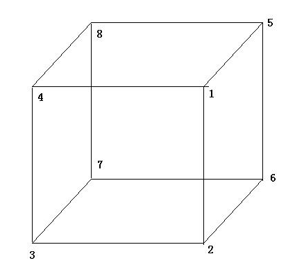
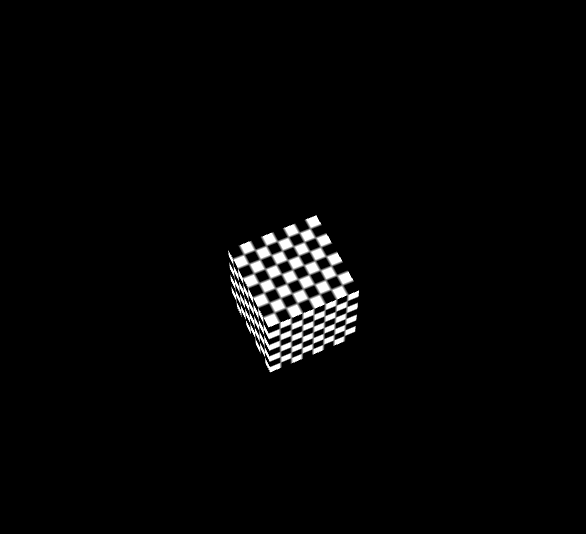

# GeometryUtil入门 #
## GeometryUtil基础 ##
	该篇教程将讲述如何使用顶点数据渲染出cube。但在这之前,我们需要简单的了解下cube数学基础： 
	（1）立方体有六个面，每个面分为两个三角形，每个三角形3个顶点，就是说，每个面需要6个顶点才能绘画出来，而一个立方体总共需要36个顶点。但是，实际上，立方体的顶
		 点只有8个。在表达立方体的36个顶点当中，有很多是重复的。这造成了严重的内存的浪费。我们可以使用元素索引数组来改善这种情况。
	（2）由于上述问题的存在，在该教程中，仅将立方体的8个顶点保存在缓冲中，在绘图时，我们通过指定各个顶点在该缓冲中的索引进行，完成正cube绘制。

**立方体参考图：**  

## GeometryUtil主要元素 ##
**Geometry.vertexFormat:**  
	使用和定义顶点的数据结构，通过（VertexFormat.VF_POSITION | VertexFormat.VF_NORMAL | VertexFormat.VF_COLOR |  VertexFormat.VF_UV0 | 
	VertexFormat.VF_UV1） 定义一个完整结构，其中：  
	VertexFormat.VF_POSITION：顶点坐标,    
	VertexFormat.VF_NORMAL:顶点法线,  
	VertexFormat.VF_TANGENT:顶点切线,  
	VertexFormat.VF_COLOR:顶点颜色,  
	VertexFormat.VF_UV0:顶点uv,  
	VertexFormat.VF_UV1:顶点第二uv,  
	VertexFormat.VF_SKIN:顶点蒙皮信息, 

 **Geometry.verticesData:**  
	顶点数据，内容为Geometry.vertexFormat定义的数据。

 **Geometry.indexData:**  
	索引数据，内容为Geometry.verticesData的index排列数组。

## 创建基础对象 ##
	var ge: egret3d.Geometry = new egret3d.Geometry();
	
## 使用和定义顶点的数据结构 ##
	ge.vertexFormat = egret3d.VertexFormat.VF_POSITION | egret3d.VertexFormat.VF_NORMAL | egret3d.VertexFormat.VF_TANGENT | 
						egret3d.VertexFormat.VF_COLOR | egret3d.VertexFormat.VF_UV0 | egret3d.VertexFormat.VF_UV1;

**说明：**  
	示例中定义的数据结构长度为: 3(VertexFormat.VF_POSITION)+3(VertexFormat.VF_NORMAL)+3(egret3d.VertexFormat.VF_TANGENT)+  
							4(egret3d.VertexFormat.VF_COLOR)+2(egret3d.VertexFormat.VF_UV0 )+2(egret3d.VertexFormat.VF_UV1)=17
	示例中使用位运算来进行数据的逻辑判断，一个枚举代表一个二进制位。  

## 定点坐标 ##
	var verticesPosition: Array<number> = new Array<number>();
 	
    verticesPosition.push(
    	0.5 * width, 0.5 * height, 0.5 * depth,
        0.5 * width, -0.5 * height, 0.5 * depth,
        -0.5 * width, -0.5 * height, 0.5 * depth,
        -0.5 * width, 0.5 * height, 0.5 * depth,
        0.5 * width, 0.5 * height, -0.5 * depth,
        0.5 * width, -0.5 * height, -0.5 * depth,
        -0.5 * width, -0.5 * height, -0.5 * depth,
        -0.5 * width, 0.5 * height, -0.5 * depth
        );   

**说明：** 
	定义矩形的八个定点，依次为前，后，左，右，上，下。可以参考该篇教程中的立方体参考图。

## 定点法线 ##
	var verticesNormal: Array<number> = new Array<number>();  
	verticesNormal.push(0.0, 0.0, 0.0);

**说明：** 
	使用默认值。

## 顶点切线 ##
	var verticesTangent: Array<number> = new Array<number>();  
    verticesTangent.push(0.0, 0.0, 0.0);

**说明：** 
	使用默认值。

## 顶点切线 ##
	var verticesColor: Array<number> = new Array<number>();
    verticesColor.push(1, 1, 1, 1);

**说明：** 
	使用默认值。

## 定点第一uv ##
	var verticesUV0: Array<number> = new Array<number>();
	verticesUV0.push(0.0, 0.0);

**说明：** 
	使用默认值。

## 定点第二uv ##
	var verticesUV1: Array<number> = new Array<number>();
    verticesUV1.push(0.0, 0.0);

**说明：** 
	使用默认值。

## 生成定点数据 ##
	for (var i = 0; i < 8; i++) {
            ge.verticesData.push(verticesPosition[i * 3], verticesPosition[i * 3 + 1], verticesPosition[i * 3 + 2]);
            ge.verticesData.push(verticesNormal[0], verticesNormal[1], verticesNormal[2]);
            ge.verticesData.push(verticesTangent[0], verticesTangent[1], verticesTangent[2]);
            ge.verticesData.push(verticesColor[0], verticesColor[1], verticesColor[2], verticesColor[3]);
            ge.verticesData.push(verticesUV0[0], verticesUV0[1]);
            ge.verticesData.push(verticesUV1[0], verticesUV1[1]);
    }

**说明：** 
	生成的定点数据和定义顶点的数据结构需要保持一致。

## 索引数据 ##
	///索引数据
	ge.indexData.push(
            //前
            0, 1, 2,
            2, 3, 0,

            //后
            4, 7, 6,
            6, 5, 4,

            //左
            3, 2, 6,
            6, 7, 3,

            //右
            4, 5, 1,
            1, 0, 4,

            //上
            4, 0, 3,
            3, 7, 4,

            //下
            1, 5, 6,
            6, 2, 1
        );

**说明：** 
	索引数据中值，对应着定点数据数组的index。可以参考该篇教程中的立方体参考图。

## 插入sub渲染队列 ##
	///生成sub
    var subGeometry: egret3d.SubGeometry = new egret3d.SubGeometry();
    subGeometry.geometry = ge;
    subGeometry.start = 0;
    subGeometry.count = ge.indexData.length;
    ///插入sub队列
    ge.subGeometrys.push(subGeometry);

## 完整示例代码 ##

	/**
	 * @language zh_CN
	 * @classdesc
	 * 创建立方体使用示例
	 * @version Egret 3.0
	 * @platform Web,Native
	 */
	class SampleGeometryUtil {
	    /**
	    * Canvas操作对象
	    * @version Egret 3.0
	    * @platform Web,Native
	    */
	    protected _egret3DCanvas: egret3d.Egret3DCanvas;
	    /**
	    * View3D操作对象
	    * @version Egret 3.0
	    * @platform Web,Native
	    */
	    protected _view3D: egret3d.View3D;
	    /**
	    * 立方体对象
	    * @version Egret 3.0
	    * @platform Web,Native
	    */
	    protected _cube: egret3d.Mesh;
	    /**
	    * look at 摄像机控制器 。
	    * 指定摄像机看向的目标对象。
	    * 1.按下鼠标左键并移动鼠标可以使摄像机绕着目标进行旋转。
	    * 2.按下键盘的(w s a d) 可以摄像机(上 下 左 右)移动。
	    * 3.滑动鼠标滚轮可以控制摄像机的视距。
	    * @version Egret 3.0
	    * @platform Web,Native
	    */
	    protected cameraCtl: egret3d.LookAtController;
	
	    public constructor() {
	        ///创建Canvas对象。
	        this._egret3DCanvas = new egret3d.Egret3DCanvas();
	        ///Canvas的起始坐标，页面左上角为起始坐标(0,0)。
	        this._egret3DCanvas.x = 0;
	        this._egret3DCanvas.y = 0;
	        ///设置Canvas页面尺寸。
	        this._egret3DCanvas.width = window.innerWidth;
	        this._egret3DCanvas.height = window.innerHeight;
	        ///创建View3D对象,页面左上角为起始坐标(0,0),其参数依次为:
	        ///@param x: number 起始坐标x,
	        ///@param y: number 起始坐标y
	        ///@param  width: number 显示区域的宽
	        ///@param  height: number 显示区域的高
	        this._view3D = new egret3d.View3D(0, 0, window.innerWidth, window.innerHeight);
	        ///当前对象对视位置,其参数依次为:
	        ///@param pos 对象的位置
	        ///@param target 目标的位置
	        this._view3D.camera3D.lookAt(new egret3d.Vector3D(0, 0, -1000), new egret3d.Vector3D(0, 0, 0));
	        ///View3D的背景色设置
	        this._view3D.backColor = 0xff000000;
	        ///将View3D添加进Canvas中
	        this._egret3DCanvas.addView3D(this._view3D);
	        ///生成立方体
	        this._cube = this.CreateCube();
	        ///将mesh插入view3D
	        this._view3D.addChild3D(this._cube);
	
	        this.InitCameraCtl();
	
	        ///启动Canvas。
	        this._egret3DCanvas.start();
	        ///注册每帧更新，让cube进行旋转
	        this._egret3DCanvas.addEventListener(egret3d.Event3D.ENTER_FRAME, this.update, this);
	
	
	    }
	
	    /**
	    * @language zh_CN        
	    * 初始化相机控制
	    * @version Egret 3.0
	    * @platform Web,Native
	    */
	    private InitCameraCtl() {
	        ///摄像机控制类
	        this.cameraCtl = new egret3d.LookAtController(this._view3D.camera3D, new egret3d.Object3D());
	        ///设置目标和相机的距离
	        this.cameraCtl.distance = 1000;
	        ///设置相机x轴旋转
	        this.cameraCtl.rotationX = 60;
	    }
	
	
	    /**
	    * @language zh_CN        
	    * 创建立方体
	    * @version Egret 3.0
	    * @platform Web,Native
	    */
	    private CreateCube(): egret3d.Mesh {
	
	        ///创建颜色材质
	        var mat: egret3d.ColorMaterial = new egret3d.ColorMaterial(0xff0000);
	        ///获取几何对象
	        var ge: egret3d.Geometry = this.CreateGeometry();
	        ///创建mesh
	        var mesh: egret3d.Mesh = new egret3d.Mesh(ge, mat);
	        return mesh;
	    }
	    /**
	    * @language zh_CN        
	    * 创建Geometry
	    * @version Egret 3.0
	    * @platform Web,Native
	    */
	    private CreateGeometry(): egret3d.Geometry {
	
	        ///创建基础对象
	        var ge: egret3d.Geometry = new egret3d.Geometry();
	        ///设置立方体的长宽高
	        var height: number = 100;
	        var width: number = 100;
	        var depth: number = 100;
	        ///使用和定义顶点的数据结构
	        ge.vertexFormat = egret3d.VertexFormat.VF_POSITION | egret3d.VertexFormat.VF_NORMAL | egret3d.VertexFormat.VF_TANGENT
                        | egret3d.VertexFormat.VF_COLOR | egret3d.VertexFormat.VF_UV0 | egret3d.VertexFormat.VF_UV1;	
	
	        ge.verticesData = new Array<number>();
	        ge.indexData = new Array<number>();
	
	        ///定点坐标
	        var verticesPosition: Array<number> = new Array<number>();
	        verticesPosition.push(
	            0.5 * width, 0.5 * height, 0.5 * depth,
	            0.5 * width, -0.5 * height, 0.5 * depth,
	            -0.5 * width, -0.5 * height, 0.5 * depth,
	            -0.5 * width, 0.5 * height, 0.5 * depth,
	            0.5 * width, 0.5 * height, -0.5 * depth,
	            0.5 * width, -0.5 * height, -0.5 * depth,
	            -0.5 * width, -0.5 * height, -0.5 * depth,
	            -0.5 * width, 0.5 * height, -0.5 * depth
	        );
	        ///定点法线  
	        var verticesNormal: Array<number> = new Array<number>();
	        verticesNormal.push(0.0, 0.0, 0.0);
	        ///顶点切线
	        var verticesTangent: Array<number> = new Array<number>();
	        verticesTangent.push(0.0, 0.0, 0.0);
	        ///定点颜色
	        var verticesColor: Array<number> = new Array<number>();
	        verticesColor.push(1, 1, 1, 1);
	        ///定点第一uv
	        var verticesUV0: Array<number> = new Array<number>();
	        verticesUV0.push(0.0, 0.0);
	        ///定点第二uv
	        var verticesUV1: Array<number> = new Array<number>();
	        verticesUV1.push(0.0, 0.0);
	
	        ///生成定点数据
	        for (var i = 0; i < 8; i++) {
	            ge.verticesData.push(verticesPosition[i * 3], verticesPosition[i * 3 + 1], verticesPosition[i * 3 + 2]);
	            ge.verticesData.push(verticesNormal[0], verticesNormal[1], verticesNormal[2]);
	            ge.verticesData.push(verticesTangent[0], verticesTangent[1], verticesTangent[2]);
	            ge.verticesData.push(verticesColor[0], verticesColor[1], verticesColor[2], verticesColor[3]);
	            ge.verticesData.push(verticesUV0[0], verticesUV0[1]);
	            ge.verticesData.push(verticesUV1[0], verticesUV1[1]);
	        }
	
	
	
	        ///索引数据
	        ge.indexData.push(
	            //前
	            0, 1, 2,
	            2, 3, 0,
	
	            //后
	            4, 7, 6,
	            6, 5, 4,
	
	            //左
	            3, 2, 6,
	            6, 7, 3,
	
	            //右
	            4, 5, 1,
	            1, 0, 4,
	
	            //上
	            4, 0, 3,
	            3, 7, 4,
	
	            //下
	            1, 5, 6,
	            6, 2, 1
	        );
	
	        ///生成sub
	        var subGeometry: egret3d.SubGeometry = new egret3d.SubGeometry();
	        subGeometry.geometry = ge;
	        subGeometry.start = 0;
	        subGeometry.count = ge.indexData.length;
	        ///插入sub队列
	        ge.subGeometrys.push(subGeometry);
	
	        return ge;
	    }
	
	    public update(e: egret3d.Event3D) {
	        this.cameraCtl.update();
	        ///旋转
	        this._cube.rotationY += 0.5;
	        this._cube.rotationX += 0.5;
	
	    }
	}      

