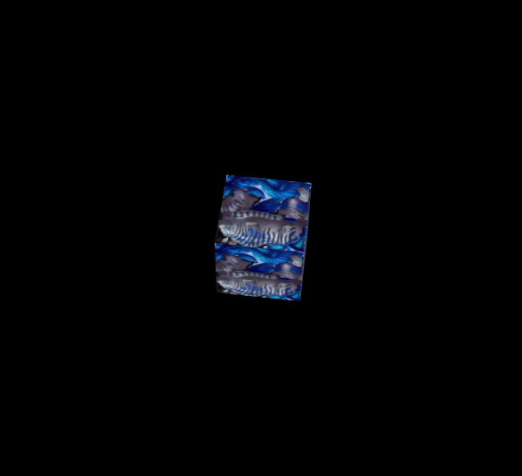
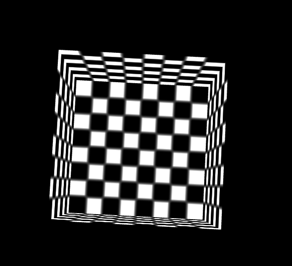

# Geometry入门 #
## Geometry基础 ##
	该篇教程将讲述如何在Egret3D创建基础的几何物体，即立方体的创建，球的创建，圆柱的创建和面片的创建。但在这之前,我们需要简单的了解下：  
	（1）CubeGeometry（立方体）：创建时，默认是一个80*80*80的正方体，也可以在构造函数中传入指定的长宽高，构建指定的立方体。
	（2）CylinderGeometry（圆柱体）：创建时，默认是一个半径为200，高为100的圆柱体，也可以在构造函数中传入指定的半径和高，构建指定的圆柱体。
	（3）SphereGeometry（球体）：创建时，默认是一个半径为100的球体，也可以在构造函数中传入指定的半径，构建指定的球体。
	（4）PlaneGeometry（面片）：创建时，默认是一个宽为500，高为500的矩形面片，也可以在构造函数中传入指定的高宽，构建指定的矩形。
	这里我们主要使用CubeGeometry来进行这篇教程的讲述。

## 创建Cube ##
	var mat: egret3d.TextureMaterial = new egret3d.TextureMaterial();  
	var geometery: egret3d.CubeGeometry = new egret3d.CubeGeometry();  
	this._cube = new egret3d.Mesh(geometery, mat);  
	
**说明：**   
	创建一个cube需要Geometry对象和Material对象，在这里我们使用默认图片材质，以及Egret3D内置cube渲染信息。  
	当构造CubeGeometry的时候，也可以传入长宽高等数据，即new egret3d.CubeGeometry(50，50，50)，不传或少传都默认为(80,80,80)。

## 创建TextureCube ##
	///读取方式一
	var img: HTMLImageElement = <HTMLImageElement>document.getElementById("mon"); 
	var tex: egret3d.ImageTexture = new egret3d.ImageTexture(img);  
	var mat: egret3d.TextureMaterial = new egret3d.TextureMaterial(tex);  
	var geometery: egret3d.CubeGeometry = new egret3d.CubeGeometry();  
	this._cube = new egret3d.Mesh(geometery, mat);
	
	///读取方式二
    var load: egret3d.URLLoader = new egret3d.URLLoader();
    load.addEventListener(egret3d.LoaderEvent3D.LOADER_COMPLETE, this.onLoadTexture, this);
	load.load("resource/laohu/Mon_04.png");
	///读取方式二 注册事件
	protected onLoadTexture(e: egret3d.LoaderEvent3D) {
        ///设置材质球的漫反射贴图。
        this.mat.diffuseTexture = e.data;
        ///注销回调
        e.loader.removeEventListener(egret3d.LoaderEvent3D.LOADER_COMPLETE, this.onLoadTexture, this);
    }

**说明：**   
	与上例相似，在读取纹理数据时候可以选择根据id在html中获取HTMLImageElement，也可以选择使用根据url路径,通过异步加载的模式完成创建。

## cullMode设置 ##
	var mat: egret3d.TextureMaterial = new egret3d.TextureMaterial();
	mat.cullMode = egret3d.ContextConfig.FRONT;
	var geometery: egret3d.CubeGeometry = new egret3d.CubeGeometry();
	this._cube = new egret3d.Mesh(geometery, mat);

**说明：**   
	cullMode，设置 cull 模式：  
	ContextConfig.FRONT：正面渲染三角形，  
	ContextConfig.BACK：背面渲染三角形。  

## 插入Cube到视图中 ##
	this._view3D.addChild3D(this._cube);

## 完整示例代码一:默认贴图 ##

	/**
	 * @language zh_CN
	 * @classdesc
	 * 创建立方体使用示例 
	 * @version Egret 3.0
	 * @platform Web,Native
	 */
	class SampleCreateCube {
	    /**
	    * Canvas操作对象
	    * @version Egret 3.0
	    * @platform Web,Native
	    */
	    protected _egret3DCanvas: egret3d.Egret3DCanvas;
	    /**
	    * View3D操作对象
	    * @version Egret 3.0
	    * @platform Web,Native
	    */
	    protected _view3D: egret3d.View3D;
	    /**
	    * 立方体对象
	    * @version Egret 3.0
	    * @platform Web,Native
	    */
	    protected _cube: egret3d.Mesh;
	    /**
	    * look at 摄像机控制器 。
	    * 指定摄像机看向的目标对象。
	    * 1.按下鼠标左键并移动鼠标可以使摄像机绕着目标进行旋转。
	    * 2.按下键盘的(w s a d) 可以摄像机(上 下 左 右)移动。
	    * 3.滑动鼠标滚轮可以控制摄像机的视距。
	    * @version Egret 3.0
	    * @platform Web,Native
	    */
	    private cameraCtl: egret3d.LookAtController;
	
	    public constructor() {
	        ///创建Canvas对象。
	        this._egret3DCanvas = new egret3d.Egret3DCanvas();
	        ///Canvas的起始坐标，页面左上角为起始坐标(0,0)。
	        this._egret3DCanvas.x = 0;
	        this._egret3DCanvas.y = 0;
	        ///设置Canvas页面尺寸。
	        this._egret3DCanvas.width = window.innerWidth;
	        this._egret3DCanvas.height = window.innerHeight;
	        ///创建View3D对象,页面左上角为起始坐标(0,0),其参数依次为:
	        ///@param x: number 起始坐标x,
	        ///@param y: number 起始坐标y
	        ///@param  width: number 显示区域的宽
	        ///@param  height: number 显示区域的高
	        this._view3D = new egret3d.View3D(0, 0, window.innerWidth, window.innerHeight);
	        ///当前对象对视位置,其参数依次为:
	        ///@param pos 对象的位置
	        ///@param target 目标的位置
	        this._view3D.camera3D.lookAt(new egret3d.Vector3D(0, 0, -1000), new egret3d.Vector3D(0, 0, 0));
	        ///View3D的背景色设置
	        this._view3D.backColor = 0xff000000;
	        ///将View3D添加进Canvas中
	        this._egret3DCanvas.addView3D(this._view3D);
	        ///创建颜色材质
	        var mat: egret3d.TextureMaterial = new egret3d.TextureMaterial();
	        ///创建立方体对象
	        var geometery: egret3d.CubeGeometry = new egret3d.CubeGeometry();
	        ///通过材质和立方体对象生成Mesh
	        this._cube = new egret3d.Mesh(geometery, mat);
	        ///将mesh插入view3D
	        this._view3D.addChild3D(this._cube);
	        ///启动Canvas。
	        this._egret3DCanvas.start();
	        ///注册每帧更新，让cube进行旋转
	        this._egret3DCanvas.addEventListener(egret3d.Event3D.ENTER_FRAME, this.update, this);
	
	        this.InitCameraCtl();
	    }
	    /**
	   * @language zh_CN        
	   * 初始化相机控制
	   * @version Egret 3.0
	   * @platform Web,Native
	   */
	    private InitCameraCtl() {
	        ///摄像机控制类
	        this.cameraCtl = new egret3d.LookAtController(this._view3D.camera3D, new egret3d.Object3D());
	        ///设置目标和相机的距离
	        this.cameraCtl.distance = 1000;
	        ///设置相机x轴旋转
	        this.cameraCtl.rotationX = 60;
	    }
	
	    public update(e: egret3d.Event3D) {
	        ///旋转
	        this._cube.rotationY += 0.5;
	        this.cameraCtl.update();
	    }
	}    

## 完整示例代码二:指定贴图 ##
	
	/**
	 * @language zh_CN
	 * @classdesc
	 * 立方体使用贴图示例
	 * @version Egret 3.0
	 * @platform Web,Native
	 */
	class SampleTextureCube {
	    /**
	    * Canvas操作对象
	    * @version Egret 3.0
	    * @platform Web,Native
	    */
	    protected _egret3DCanvas: egret3d.Egret3DCanvas;
	    /**
	    * View3D操作对象
	    * @version Egret 3.0
	    * @platform Web,Native
	    */
	    protected _view3D: egret3d.View3D;
	    /**
	    * 立方体对象
	    * @version Egret 3.0
	    * @platform Web,Native
	    */
	    protected _cube: egret3d.Mesh;
	    /**
	    * look at 摄像机控制器 。
	    * 指定摄像机看向的目标对象。
	    * 1.按下鼠标左键并移动鼠标可以使摄像机绕着目标进行旋转。
	    * 2.按下键盘的(w s a d) 可以摄像机(上 下 左 右)移动。
	    * 3.滑动鼠标滚轮可以控制摄像机的视距。
	    * @version Egret 3.0
	    * @platform Web,Native
	    */
	    private cameraCtl: egret3d.LookAtController;
	
	
	    public constructor() {
	        ///创建Canvas对象。
	        this._egret3DCanvas = new egret3d.Egret3DCanvas();
	        ///Canvas的起始坐标，页面左上角为起始坐标(0,0)。
	        this._egret3DCanvas.x = 0;
	        this._egret3DCanvas.y = 0;
	        ///设置Canvas页面尺寸。
	        this._egret3DCanvas.width = window.innerWidth;
	        this._egret3DCanvas.height = window.innerHeight;
	        ///创建View3D对象,页面左上角为起始坐标(0,0),其参数依次为:
	        ///@param x: number 起始坐标x,
	        ///@param y: number 起始坐标y
	        ///@param  width: number 显示区域的宽
	        ///@param  height: number 显示区域的高
	        this._view3D = new egret3d.View3D(0, 0, window.innerWidth, window.innerHeight);
	        ///当前对象对视位置,其参数依次为:
	        ///@param pos 对象的位置
	        ///@param target 目标的位置
	        this._view3D.camera3D.lookAt(new egret3d.Vector3D(0, 0, -1000), new egret3d.Vector3D(0, 0, 0));
	        ///View3D的背景色设置
	        this._view3D.backColor = 0xff000000;
	        ///将View3D添加进Canvas中
	        this._egret3DCanvas.addView3D(this._view3D);
	        ///根据id在html中获取HTMLImageElement
	        var img: HTMLImageElement = <HTMLImageElement>document.getElementById("mon");
	        ///创建ImageTexture
	        var tex: egret3d.ImageTexture = new egret3d.ImageTexture(img);
	        ///创建TextureMaterial
	        var mat: egret3d.TextureMaterial = new egret3d.TextureMaterial(tex);
	        ///创建立方体对象
	        var geometery: egret3d.CubeGeometry = new egret3d.CubeGeometry();
	        ///通过材质和立方体对象生成Mesh
	        this._cube = new egret3d.Mesh(geometery, mat);
	        ///将mesh插入view3D
	        this._view3D.addChild3D(this._cube);
	        ///启动Canvas。
	        this._egret3DCanvas.start();
	        ///注册每帧更新，让cube进行旋转
	        this._egret3DCanvas.addEventListener(egret3d.Event3D.ENTER_FRAME, this.update, this);
	
	        this.InitCameraCtl();
	    }
	
	    /**
	    * @language zh_CN        
	    * 初始化相机控制
	    * @version Egret 3.0
	    * @platform Web,Native
	    */
	    private InitCameraCtl() {
	        ///摄像机控制类
	        this.cameraCtl = new egret3d.LookAtController(this._view3D.camera3D, new egret3d.Object3D());
	        ///设置目标和相机的距离
	        this.cameraCtl.distance = 1000;
	        ///设置相机x轴旋转
	        this.cameraCtl.rotationX = 60;
	    }
	
	    public update(e: egret3d.Event3D) {
	        this.cameraCtl.update();
	        ///旋转
	        this._cube.rotationY += 0.5;
	        this._cube.rotationX += 0.5;
	    }
	}     

## 完整示例代码二:背面剔除 ##

	/**
	 * @language zh_CN
	 * @classdesc
	 * 正反面设置使用示例 
	 * @version Egret 3.0
	 * @platform Web,Native
	 */
	class SampleCullMode {
	    /**
	    * Canvas操作对象
	    * @version Egret 3.0
	    * @platform Web,Native
	    */
	    protected _egret3DCanvas: egret3d.Egret3DCanvas;
	    /**
	    * View3D操作对象
	    * @version Egret 3.0
	    * @platform Web,Native
	    */
	    protected _view3D: egret3d.View3D;
	    /**
	    * 立方体对象
	    * @version Egret 3.0
	    * @platform Web,Native
	    */
	    protected _cube: egret3d.Mesh;
	    /**
	    * look at 摄像机控制器 。
	    * 指定摄像机看向的目标对象。
	    * 1.按下鼠标左键并移动鼠标可以使摄像机绕着目标进行旋转。
	    * 2.按下键盘的(w s a d) 可以摄像机(上 下 左 右)移动。
	    * 3.滑动鼠标滚轮可以控制摄像机的视距。
	    * @version Egret 3.0
	    * @platform Web,Native
	    */
	    private cameraCtl: egret3d.LookAtController;
	
	    public constructor() {
	        ///创建Canvas对象。
	        this._egret3DCanvas = new egret3d.Egret3DCanvas();
	        ///Canvas的起始坐标，页面左上角为起始坐标(0,0)。
	        this._egret3DCanvas.x = 0;
	        this._egret3DCanvas.y = 0;
	        ///设置Canvas页面尺寸。
	        this._egret3DCanvas.width = window.innerWidth;
	        this._egret3DCanvas.height = window.innerHeight;
	        ///创建View3D对象,页面左上角为起始坐标(0,0),其参数依次为:
	        ///@param x: number 起始坐标x,
	        ///@param y: number 起始坐标y
	        ///@param  width: number 显示区域的宽
	        ///@param  height: number 显示区域的高
	        this._view3D = new egret3d.View3D(0, 0, window.innerWidth, window.innerHeight);
	        ///当前对象对视位置,其参数依次为:
	        ///@param pos 对象的位置
	        ///@param target 目标的位置
	        this._view3D.camera3D.lookAt(new egret3d.Vector3D(0, 0, -1000), new egret3d.Vector3D(0, 0, 0));
	        ///View3D的背景色设置
	        this._view3D.backColor = 0xff000000;
	        ///将View3D添加进Canvas中
	        this._egret3DCanvas.addView3D(this._view3D);
	        ///创建颜色材质
	        var mat: egret3d.TextureMaterial = new egret3d.TextureMaterial();
	        ///设置正反面
	        mat.cullMode = egret3d.ContextConfig.FRONT;
	
	        ///创建立方体对象
	        var geometery: egret3d.CubeGeometry = new egret3d.CubeGeometry();
	        ///通过材质和立方体对象生成Mesh
	        this._cube = new egret3d.Mesh(geometery, mat);
	
	        ///将mesh插入view3D
	        this._view3D.addChild3D(this._cube);
	        ///启动Canvas。
	        this._egret3DCanvas.start();
	        ///注册每帧更新，让cube进行旋转
	        this._egret3DCanvas.addEventListener(egret3d.Event3D.ENTER_FRAME, this.update, this);
	
	
	        this.InitCameraCtl();
	    }
	    /**
	   * @language zh_CN        
	   * 初始化相机控制
	   * @version Egret 3.0
	   * @platform Web,Native
	   */
	    private InitCameraCtl() {
	        ///摄像机控制类
	        this.cameraCtl = new egret3d.LookAtController(this._view3D.camera3D, new egret3d.Object3D());
	        ///设置目标和相机的距离
	        this.cameraCtl.distance = 1000;
	        ///设置相机x轴旋转
	        this.cameraCtl.rotationX = 60;
	    }
	
	    public update(e: egret3d.Event3D) {
	        this.cameraCtl.update();
	    }
	}    

