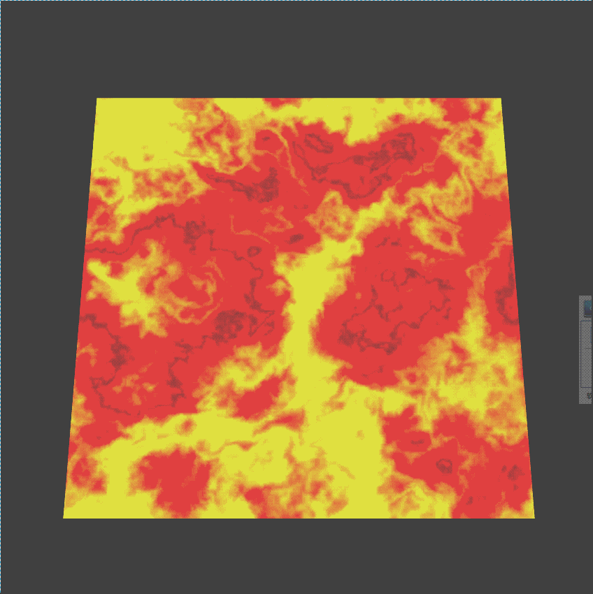

# UV滚动 #
## UV滚动基础 ##
	该篇教程将讲述关于Egret引擎中UV滚动功能的实现方法，首先我们了解一下以下内容：
	（1）UV：
		"UV"这里是指u,v纹理贴图坐标的简称(它和空间模型的X, Y, Z轴是类似的)。它定义了图片上每个点的位置的信息。这些点与3D模型是相互联系的, 以决定表面纹  
		理贴图的位置。 UV就是将图像上每一个点精确对应到模型物体的表面。在点与点之间的间隙位置由软件进行图像光滑插值处理。 这就是所谓的UV贴图。 那为什么用  
		UV坐标而不是标准的投影坐标呢? 通常给物体纹理贴图最标准的方法就是以planar(平面),cylindrical(圆柱), spherical(球形),cubic(方盒)坐标方式投  
		影贴图。 Planar projection(平面投影方式)是将图像沿x,y或z轴直接投影到物体。这种方法使用于纸张,布告,书的封面等,也就是表面平整的物体。平面投影的  
		缺点是如果表面不平整, 或者物体边缘弯曲, 就会产生如图A的不理想接缝和变形. 避免这种情况需要创建带有alpha通道的图像, 来掩盖临近的平面投影接缝,   
		而这会是非常烦琐的工作。 所以不要对有较大厚度的物体和不平整的表面运用平面投影方式。对于立方体可以在x, y方向分别进行平面投影, 但是要注意边缘接缝  
		的融合。或者采用无缝连续的纹理, 并使用cubic投影方式。 多数软件有图片自动缩放功能, 使图像与表面吻合。 显然, 如果你的图像与表面形状不同, 自动缩放  
		就会改变图像的比例以吻合表面。 这通常会产生不理想的效果, 所以制作贴图前先测量你的物体尺寸。

## UV滚动的主要元素 ##
**TextureMaterial.repeat:**  
	纹理重复采样的方式开关，循环滚动uv的时候必须要设置为true。

## 设置纹理参数 ##
	///添加面片
	this.matPlane = new egret3d.TextureMaterial();
	///纹理重复采样的方式开关
	this.matPlane.repeat = true;
	///混合模式
	this.matPlane.blendMode = egret3d.BlendMode.ADD;
	var plane = new egret3d.Mesh(new egret3d.PlaneGeometry(1000, 1000, 10, 10, 1, 1), this.matPlane);
	this._view3D.addChild3D(plane);

## 添加UV滚动渲染方式 ##
	///UV滚动渲染方式
	var uvRollMethod: egret3d.UVRollMethod = new egret3d.UVRollMethod();
	///添加渲染方式
	this.matPlane.diffusePass.addMethod(uvRollMethod);
	///开始播放
	uvRollMethod.start(true);

## 完整示例代码 ##

	/**
	* @language zh_CN
	* @classdesc
	* UV滚动使用示例
	* @version Egret 3.0
	* @platform Web,Native
	*/
	class SampleUvRoll {
	
	    /**
	    * Canvas操作对象
	    * @version Egret 3.0
	    * @platform Web,Native
	    */
	    protected _egret3DCanvas: egret3d.Egret3DCanvas;
	    /**
	    * View3D操作对象
	    * @version Egret 3.0
	    * @platform Web,Native
	    */
	    protected _view3D: egret3d.View3D;
	
	    /**
	    * 面片纹理
	    * @version Egret 3.0
	    * @platform Web,Native
	    */
	    protected matPlane: egret3d.TextureMaterial;
	
	    /**
	    * 摄像机控制器 ,实现摄像机平滑移动
	    * @version Egret 3.0
	    * @platform Web,Native
	    */
	    protected ctl: egret3d.HoverController;
	
	    public constructor() {
	
	        super();
	
	        ///创建Canvas对象。
	        this._egret3DCanvas = new egret3d.Egret3DCanvas();
	        ///Canvas的起始坐标，页面左上角为起始坐标(0,0)。
	        this._egret3DCanvas.x = 0;
	        this._egret3DCanvas.y = 0;
	        ///设置Canvas页面尺寸。
	        this._egret3DCanvas.width = window.innerWidth;
	        this._egret3DCanvas.height = window.innerHeight;
	        ///创建View3D对象,页面左上角为起始坐标(0,0),其参数依次为:
	        ///@param x: number 起始坐标x,
	        ///@param y: number 起始坐标y
	        ///@param  width: number 显示区域的宽
	        ///@param  height: number 显示区域的高
	        this._view3D = new egret3d.View3D(0, 0, window.innerWidth, window.innerHeight);
	        ///当前对象对视位置,其参数依次为:
	        ///@param pos 对象的位置
	        ///@param target 目标的位置
	        this._view3D.camera3D.lookAt(new egret3d.Vector3D(0, 0, -1000), new egret3d.Vector3D(0, 0, 0));
	        ///View3D的背景色设置
	        this._view3D.backColor = 0xff000000;
	        ///将View3D添加进Canvas中
	        this._egret3DCanvas.addView3D(this._view3D);
	        ///启动Canvas。
	        this._egret3DCanvas.start();
	        ///设置window resize事件
	        egret3d.Input.addEventListener(egret3d.Event3D.RESIZE, this.OnWindowResize, this);
	
	        ///初始化摄像机控制器
	        this.ctl = new egret3d.HoverController(this._view3D.camera3D);
	        this.ctl.tiltAngle = 60;
	        this.ctl.distance = 1000;
	
	        ///添加面片
	        this.matPlane = new egret3d.TextureMaterial();
	        ///纹理重复采样的方式开关
	        this.matPlane.repeat = true;
	        ///混合模式
	        this.matPlane.blendMode = egret3d.BlendMode.ADD;
	        var plane = new egret3d.Mesh(new egret3d.PlaneGeometry(1000, 1000, 10, 10, 1, 1), this.matPlane);
	        this._view3D.addChild3D(plane);
	        ///读取纹理
	        var loadDiffuse: egret3d.URLLoader = new egret3d.URLLoader();
	        loadDiffuse.addEventListener(egret3d.LoaderEvent3D.LOADER_COMPLETE, this.onLoadDiffuse, this);
	        loadDiffuse.load("resource/effect/Lava_05.png");
	
	        ///UV滚动渲染方式
	        var uvRollMethod: egret3d.UVRollMethod = new egret3d.UVRollMethod();
	        ///添加渲染方式
	        this.matPlane.diffusePass.addMethod(uvRollMethod);
	        ///开始播放
	        uvRollMethod.start(true);
	
	        this._egret3DCanvas.addEventListener(egret3d.Event3D.ENTER_FRAME, this.update, this);
	    }
	    /**
	    * @language zh_CN        
	    * 读取纹理回调
	    * @version Egret 3.0
	    * @platform Web,Native
	    */
	    protected onLoadDiffuse(e: egret3d.LoaderEvent3D) {
	        this.matPlane.diffuseTexture = e.loader.data;
	    }
	    /**
	    * @language zh_CN        
	    * 窗口尺寸变化事件
	    * @version Egret 3.0
	    * @platform Web,Native
	    */
	    private OnWindowResize(e: egret3d.Event3D): void {
	        ///重置ui大小
	        this._egret3DCanvas.width = window.innerWidth;
	        this._egret3DCanvas.height = window.innerHeight;
	        this._view3D.width = window.innerWidth;
	        this._view3D.height = window.innerHeight;
	    }
	
	    public update(e: egret3d.Event3D) {
	        this.ctl.update();
	    }
	
	}   

  

	