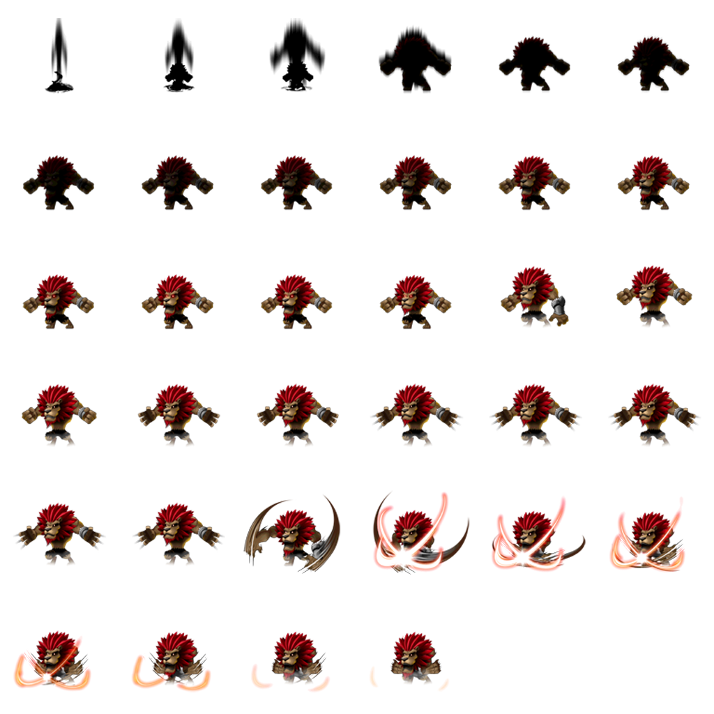
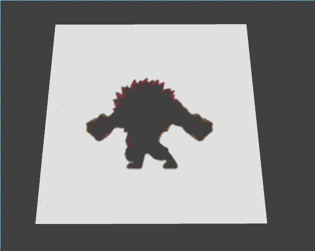

# UV序列帧动画 #
## UV序列帧动画基础 ##
	该篇教程将讲述关于Egret引擎中UV序列帧动画的实现方法，首先我们了解一下以下内容：
	1）UV：
		请参考UV滚动示例中对于UV解释。
	2）序列帧动画:
		序列帧动画是一种常见的动画形式，其原理是在“连续的关键帧”中分解动画动作，也就是在时间轴的每帧上逐帧绘制不同的图片内容，使其连续播放而成动画。 因为序  
		列帧动画的帧序列内容不一样，不但给制作增加了负担而且最终输出的文件量也很大，但它的优势也很明显：逐帧动画具有非常大的灵活性，几乎可以表现任何想表现  
		的内容，而它类似与电影的播放模式，很适合于表演细腻的动画。

## UV滚动的主要元素 ##
**UVSpriteSheetMethod.constructor(frameNum: number, row: number, column: number, numTime:number ):**  
	序列帧动画渲染方式的构造函数，其主要参数如下：  
	frameNum:帧数量。  
	row:行数。  
	column:列数。  
	numTime:播放总时间。  

**参考图:**  
  

## 添加UV滚动渲染方式 ##
	///UV序列帧动画
    var uvSpriteSheetMethod: egret3d.UVSpriteSheetMethod = new egret3d.UVSpriteSheetMethod(34, 6, 6, 3.0);
	///添加渲染方式
	this.matPlane.diffusePass.addMethod(uvSpriteSheetMethod);
	///抗锯齿设置
	this.matPlane.smooth = false;
	///开始播放
	uvSpriteSheetMethod.start(true);

## 完整示例代码 ##
	/**
	 * @language zh_CN
	 * @classdesc
	 * UV序列帧动画使用示例
	 * @version Egret 3.0
	 * @platform Web,Native
	 */
	class SampleUvSpriteSheet {
	
	    /**
	    * Canvas操作对象
	    * @version Egret 3.0
	    * @platform Web,Native
	    */
	    protected _egret3DCanvas: egret3d.Egret3DCanvas;
	    /**
	    * View3D操作对象
	    * @version Egret 3.0
	    * @platform Web,Native
	    */
	    protected _view3D: egret3d.View3D;
	
	    /**
	    * 面片纹理
	    * @version Egret 3.0
	    * @platform Web,Native
	    */
	    protected matPlane: egret3d.TextureMaterial;
	
	    /**
	    * 摄像机控制器 ,实现摄像机平滑移动
	    * @version Egret 3.0
	    * @platform Web,Native
	    */
	    protected ctl: egret3d.HoverController;
	
	    public constructor() {
	
	        super();
	
	        ///创建Canvas对象。
	        this._egret3DCanvas = new egret3d.Egret3DCanvas();
	        ///Canvas的起始坐标，页面左上角为起始坐标(0,0)。
	        this._egret3DCanvas.x = 0;
	        this._egret3DCanvas.y = 0;
	        ///设置Canvas页面尺寸。
	        this._egret3DCanvas.width = window.innerWidth;
	        this._egret3DCanvas.height = window.innerHeight;
	        ///创建View3D对象,页面左上角为起始坐标(0,0),其参数依次为:
	        ///@param x: number 起始坐标x,
	        ///@param y: number 起始坐标y
	        ///@param  width: number 显示区域的宽
	        ///@param  height: number 显示区域的高
	        this._view3D = new egret3d.View3D(0, 0, window.innerWidth, window.innerHeight);
	        ///当前对象对视位置,其参数依次为:
	        ///@param pos 对象的位置
	        ///@param target 目标的位置
	        this._view3D.camera3D.lookAt(new egret3d.Vector3D(0, 0, -1000), new egret3d.Vector3D(0, 0, 0));
	        ///View3D的背景色设置
	        this._view3D.backColor = 0xff000000;
	        ///将View3D添加进Canvas中
	        this._egret3DCanvas.addView3D(this._view3D);
	        ///启动Canvas。
	        this._egret3DCanvas.start();
	        ///设置window resize事件
	        egret3d.Input.addEventListener(egret3d.Event3D.RESIZE, this.OnWindowResize, this);
	
	        ///初始化摄像机控制器
	        this.ctl = new egret3d.HoverController(this._view3D.camera3D);
	        this.ctl.tiltAngle = 60;
	        this.ctl.distance = 1000;
	
	        ///添加面片
	        this.matPlane = new egret3d.TextureMaterial();
	        var plane = new egret3d.Mesh(new egret3d.PlaneGeometry(1000, 1000, 10, 10, 1, 1), this.matPlane);
	        this._view3D.addChild3D(plane);
	
	        ///UV序列帧动画
	        var uvSpriteSheetMethod: egret3d.UVSpriteSheetMethod = new egret3d.UVSpriteSheetMethod(34, 6, 6, 3.0);
	        ///添加渲染方式
	        this.matPlane.diffusePass.addMethod(uvSpriteSheetMethod);
	        ///抗锯齿设置
	        this.matPlane.smooth = false;
	        ///开始播放
	        uvSpriteSheetMethod.start(true);
	
	        ///加载纹理资源
	        var loadDiffuse: egret3d.URLLoader = new egret3d.URLLoader();
	        loadDiffuse.addEventListener(egret3d.LoaderEvent3D.LOADER_COMPLETE, this.onLoadDiffuse, this);
	        loadDiffuse.load("resource/squen/test1.png");
	
	      
	
	        this._egret3DCanvas.addEventListener(egret3d.Event3D.ENTER_FRAME, this.update, this);
	    }
	
	    /**
	    * @language zh_CN        
	    * 读取纹理回调
	    * @version Egret 3.0
	    * @platform Web,Native
	    */
	    protected onLoadDiffuse(e: egret3d.LoaderEvent3D) {
	        this.matPlane.diffuseTexture = e.loader.data;
	    }
	
	    /**
	    * @language zh_CN        
	    * 窗口尺寸变化事件
	    * @version Egret 3.0
	    * @platform Web,Native
	    */
	    private OnWindowResize(e: egret3d.Event3D): void {
	        ///重置ui大小
	        this._egret3DCanvas.width = window.innerWidth;
	        this._egret3DCanvas.height = window.innerHeight;
	        this._view3D.width = window.innerWidth;
	        this._view3D.height = window.innerHeight;
	    }
	
	    public update(e: egret3d.Event3D) {
	        this.ctl.update();
	    }
	}    

  