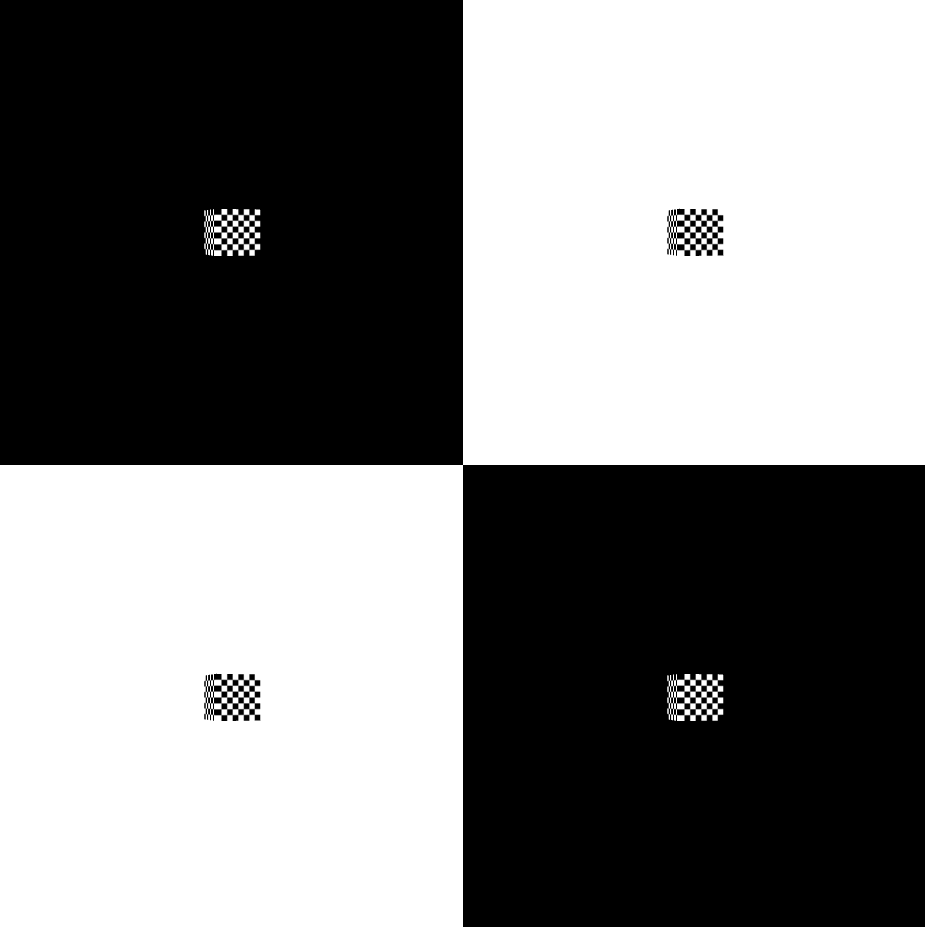

# View3D入门 #
## View3D基础 ##
	 渲染视图，是整个3D引擎的渲染视口，可以控制渲染窗口的大小，渲染的方式。渲染视图可以设置不同的相机，也可以交换不同的场景元素，同时天空盒需要在这里直接设置。  

## View3D主要元素 ##
**View3D._viewPort:**  
	视图区域，保存了区域的大小和显示位置等信息。

**View3D._aspectRatio:**  
	屏幕高宽比。

**View3D._camera:**  
	3D摄相机，该对象会执行相机数据处理，生成3D摄相机，其中相机分为透视摄像机、正交摄像机、VR摄像机。

**View3D._scene:**  
	场景，场景是一个容器，我们通过场景这个容器，来编辑、布置游戏中玩家所能见到的图像和声音等元素。

**View3D._entityCollect:**  
	渲染对象收集器，把渲染对象进行可视筛选，并且划分渲染层级，依次排序到加入列表。

**View3D._backColor:**  
	视图区域的背景色。

## 创建View3D ##
	this._view3D = new egret3d.View3D(0, 0, window.innerWidth, window.innerHeight);

**说明：**   
	在Egret3D中的屏幕坐标，包括整个屏幕，屏幕的左上角为（0, 0），这里我们一般设置(0.0)为屏幕起始坐标。
	window.innerWidth，window.innerHeight分别为当前屏幕的宽和高。   

## 设置摄像机 ##
	this._view3D.camera3D.lookAt(new egret3d.Vector3D(0, 0, -1000), new egret3d.Vector3D(0, 0, 0));

**说明：**   
	设置相机对视位置，其参数依次为:  
	pos: Vector3D 对象的位置，  
	target: Vector3D 目标的位置，  
	up: Vector3D 向上的方向，忽略时该参数默认为(0, 1, 0)  。

## 背景色设置 ##
	this._view3D.backColor = 0xff000000;

**说明：**   
	颜色值为十六进制颜色码。

## 将View3D添加进Canvas中 ##
	this._egret3DCanvas.addView3D(this._view3D);

## 完整示例代码一 ##

	/**
	 * @language zh_CN
	 * @classdesc
	 * 创建单个View3D使用示例
	 * @version Egret 3.0
	 * @platform Web,Native
	 */
	class SampleView3D {
	
	    /**
	    * Canvas操作对象
	    * @version Egret 3.0
	    * @platform Web,Native
	    */
	    protected _egret3DCanvas: egret3d.Egret3DCanvas;
	    /**
	    * View3D操作对象
	    * @version Egret 3.0
	    * @platform Web,Native
	    */
	    protected _view3D: egret3d.View3D;
	
	    public constructor() {
	        ///创建Canvas对象。
	        this._egret3DCanvas = new egret3d.Egret3DCanvas();
	        ///Canvas的起始坐标，页面左上角为起始坐标(0,0)。
	        this._egret3DCanvas.x = 0;
	        this._egret3DCanvas.y = 0;
	        ///设置Canvas页面尺寸。
	        this._egret3DCanvas.width = window.innerWidth;
	        this._egret3DCanvas.height = window.innerHeight;
	        ///创建View3D对象,页面左上角为起始坐标(0,0),其参数依次为:
	        ///@param x: number 起始坐标x,
	        ///@param y: number 起始坐标y
	        ///@param  width: number 显示区域的宽
	        ///@param  height: number 显示区域的高
	        this._view3D = new egret3d.View3D(0, 0, window.innerWidth, window.innerHeight);
	        ///当前对象对视位置,其参数依次为:
	        ///@param pos 对象的位置
	        ///@param target 目标的位置
	        this._view3D.camera3D.lookAt(new egret3d.Vector3D(0, 0, -1000), new egret3d.Vector3D(0, 0, 0));
	        ///View3D的背景色设置
	        this._view3D.backColor = 0xff000000;
	        ///将View3D添加进Canvas中
	        this._egret3DCanvas.addView3D(this._view3D);
	        ///启动Canvas。
	        this._egret3DCanvas.start();
	    }
	}   

## 完整示例代码二 多View3D显示##

	/**
	 * @language zh_CN
	 * @classdesc
	 * 创建多个个View3D使用示例
	 * @version Egret 3.0
	 * @platform Web,Native
	 */
	class SampleMultipleView3D {
	    /**
	    * Canvas操作对象
	    * @version Egret 3.0
	    * @platform Web,Native
	    */
	    protected _egret3DCanvas: egret3d.Egret3DCanvas;
	
	    protected _cubeArray: Array<egret3d.Mesh>;
	
	    public constructor() {
	
	        this._cubeArray = new Array<egret3d.Mesh>();
	
	        ///创建Canvas对象。
	        this._egret3DCanvas = new egret3d.Egret3DCanvas();
	        ///Canvas的起始坐标，页面左上角为起始坐标(0,0)。
	        this._egret3DCanvas.x = 0;
	        this._egret3DCanvas.y = 0;
	        ///设置Canvas页面尺寸。
	        this._egret3DCanvas.width = window.innerWidth;
	        this._egret3DCanvas.height = window.innerHeight;
	        ///每个view3d的显示大小
	        var viewHeight = window.innerHeight * 0.5;
	        var viewWidth = window.innerWidth * 0.5;
	        ///背景色数组
	        var colors: Array<number> = new Array<number>();
	        colors.push(0xff000000);
	        colors.push(0xffffffff);
	        colors.push(0xffffffff);
	        colors.push(0xff000000);
	        ///生成四个view3d填充Canvas
	        for (var i: number = 0; i < 2; i++) {
	            for (var j: number = 0; j < 2; j++) {
	
	                ///起始坐标计算
	                var index = i * 2 + j;
	                var startPosX = j * viewWidth;
	                var startPosY = i * viewHeight;
	                ///创建View3D对象,页面左上角为起始坐标(0,0),其参数依次为:
	                ///@param x: number 起始坐标x,
	                ///@param y: number 起始坐标y
	                ///@param  width: number 显示区域的宽
	                ///@param  height: number 显示区域的高
	                var view3D = new egret3d.View3D(startPosX, startPosY, viewWidth, viewHeight);
	                ///当前对象对视位置,其参数依次为:
	                ///@param pos 对象的位置
	                ///@param target 目标的位置
	                view3D.camera3D.lookAt(new egret3d.Vector3D(0, 0, -1000), new egret3d.Vector3D(0, 0, 0));
	                ///View3D的背景色设置
	                view3D.backColor = colors[index];
	                ///将View3D添加进Canvas中
	                this._egret3DCanvas.addView3D(view3D);
	
	                ///创建颜色材质
	                var mat: egret3d.TextureMaterial = new egret3d.TextureMaterial();
	                ///创建立方体对象
	                var geometery: egret3d.CubeGeometry = new egret3d.CubeGeometry();
	                ///通过材质和立方体对象生成Mesh
	                var cube = new egret3d.Mesh(geometery, mat);
	                ///将mesh插入view3D
	                view3D.addChild3D(cube);
	
	                this._cubeArray.push(cube);
	
	            }
	        }
	        ///启动Canvas。
	        this._egret3DCanvas.start();
	        this._egret3DCanvas.addEventListener(egret3d.Event3D.ENTER_FRAME, this.update, this);
	    }
	
	    public update(e: egret3d.Event3D) {
	        ///旋转
	        var len = this._cubeArray.length;
	        for (var i = 0; i < len; i++) {
	            this._cubeArray[i].rotationY += 0.5;
	        }
	    }
	}    

