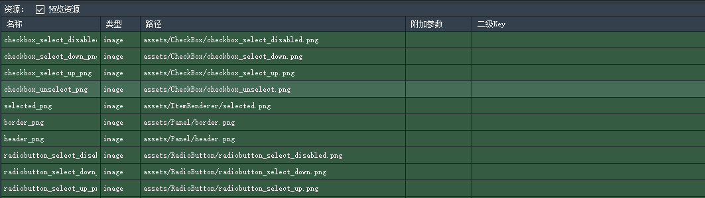
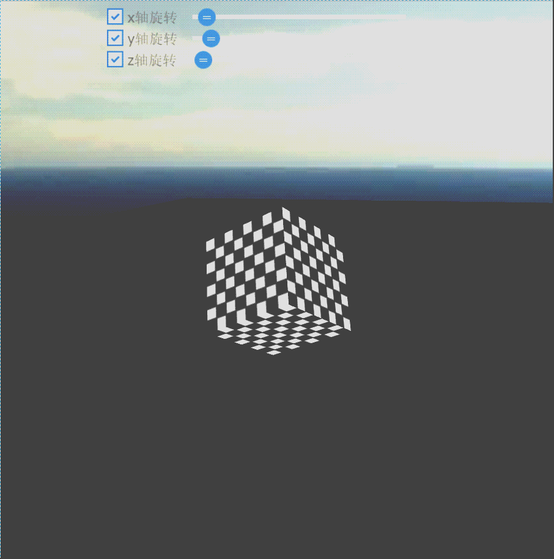

# 2D混合 #
## 2D混合基础 ##
	该篇教程将讲述关于Egret引擎中2D内容与3D内容交互使用说明：

## 加载2D资源 ##
	//注入自定义的素材解析器
	var assetAdapter = new AssetAdapter();
	this.stage.registerImplementation("eui.IAssetAdapter",assetAdapter);
	this.stage.registerImplementation("eui.IThemeAdapter",new ThemeAdapter());
	//初始化Resource资源加载库
    RES.addEventListener(RES.ResourceEvent.CONFIG_COMPLETE, this.onConfigComplete, this);
    RES.loadConfig("resource/default.res.json", "resource/");

**说明:**  
	default.res.json为资源列表,将资源信息加载到内存中,如图下所示：

## 加载2D UI组件默认主题文件 ##
	 //加载皮肤主题配置文件,可以手动修改这个文件。替换默认皮肤。
	var theme = new eui.Theme("resource/default.thm.json", this.stage);
	theme.addEventListener(eui.UIEvent.COMPLETE, this.onThemeLoadComplete, this);
	RES.addEventListener(RES.ResourceEvent.GROUP_COMPLETE, this.onResourceLoadComplete, this);
	RES.addEventListener(RES.ResourceEvent.GROUP_LOAD_ERROR, this.onResourceLoadError, this);
	RES.addEventListener(RES.ResourceEvent.GROUP_PROGRESS, this.onResourceProgress, this);
	RES.addEventListener(RES.ResourceEvent.ITEM_LOAD_ERROR, this.onItemLoadError, this);
	RES.loadGroup("preload");

**说明:**  
	default.thm.json为UI皮肤对应关系，exmls-skins，详情可以前往Egret主页查询2D Api信息。

## 生成2D控件 ##
	//注册x轴旋转checkbox
	var rotationXCheckBox = new eui.CheckBox();
	rotationXCheckBox.label="x轴旋转";
	rotationXCheckBox.x=0;
	rotationXCheckBox.y=10;
	this.addChild(rotationXCheckBox);
	///注册CheckBox事件
	rotationXCheckBox.addEventListener(egret.Event.CHANGE,e=> this.view.isRotationX = rotationXCheckBox.selected ,this);
	//注册x轴旋转速度调节条  
	var speedXslider = new eui.HSlider();
	speedXslider.x=120;
	speedXslider.y=12;
	speedXslider.width=300;
	speedXslider.height=20;
	speedXslider.minimum=0;
	speedXslider.maximum=100;
	this.addChild(speedXslider);
	///注册Slider事件
	speedXslider.addEventListener(egret.Event.CHANGE,e=> this.view.rotationXSpeed = 0.05 * speedXslider.value + 0.5,this);

**说明:**  
	这里我们创建一个勾选框，来控制是否开该方向上的旋转功能。又创建了一个可以拖动滑条，用来控制旋转速度。如图所示：

## 创建3D显示区域 ##
	this._egret3DCanvas = new egret3d.Egret3DCanvas();
	///Canvas的起始坐标，页面左上角为起始坐标(0,0)。
	this._egret3DCanvas.x = 0;
	this._egret3DCanvas.y = 0;
	///设置Canvas页面尺寸。
	this._egret3DCanvas.width = window.innerWidth;
	this._egret3DCanvas.height = window.innerHeight;
	///创建View3D对象,页面左上角为起始坐标(0,0),其参数依次为:
	///@param x: number 起始坐标x,
	///@param y: number 起始坐标y
	///@param  width: number 显示区域的宽
	///@param  height: number 显示区域的高
	this._view3D = new egret3d.View3D(0,0,window.innerWidth,window.innerHeight);
	///当前对象对视位置,其参数依次为:
	///@param pos 对象的位置
	///@param target 目标的位置
	this._view3D.camera3D.lookAt(new egret3d.Vector3D(200, 200,-1000),new egret3d.Vector3D(0,0,0));
	///View3D的背景色设置
	this._view3D.backColor = 0xffffffff;
	///将View3D添加进Canvas中
	this._egret3DCanvas.addView3D(this._view3D);
	///启动Canvas。
	this._egret3DCanvas.start();

**说明:**  
	我们可以通过参数设置等方式，来生成满足我们需求的显示区域，同时2D ui层次始终高于3D显示区域。

## 完整示例代码一:Main.Ts ##

	class Main extends eui.UILayer {
	    /**
	     * 加载进度界面
	     * loading process interface
	     */
	    private loadingView: LoadingUI;
	    protected createChildren(): void {
	        super.createChildren();
	        //inject the custom material parser
	        //注入自定义的素材解析器
	        var assetAdapter = new AssetAdapter();
	        this.stage.registerImplementation("eui.IAssetAdapter",assetAdapter);
	        this.stage.registerImplementation("eui.IThemeAdapter",new ThemeAdapter());
	        //Config loading process interface
	        //设置加载进度界面
	        this.loadingView = new LoadingUI();
	        this.stage.addChild(this.loadingView);
	        // initialize the Resource loading library
	        //初始化Resource资源加载库
	        RES.addEventListener(RES.ResourceEvent.CONFIG_COMPLETE, this.onConfigComplete, this);
	        RES.loadConfig("resource/default.res.json", "resource/");
	    }
	    /**
	     * 配置文件加载完成,开始预加载皮肤主题资源和preload资源组。
	     * Loading of configuration file is complete, start to pre-load the theme configuration file and the preload resource group
	     */
	    private onConfigComplete(event:RES.ResourceEvent):void {
	        RES.removeEventListener(RES.ResourceEvent.CONFIG_COMPLETE, this.onConfigComplete, this);
	        // load skin theme configuration file, you can manually modify the file. And replace the default skin.
	        //加载皮肤主题配置文件,可以手动修改这个文件。替换默认皮肤。
	        var theme = new eui.Theme("resource/default.thm.json", this.stage);
	        theme.addEventListener(eui.UIEvent.COMPLETE, this.onThemeLoadComplete, this);
	
	        RES.addEventListener(RES.ResourceEvent.GROUP_COMPLETE, this.onResourceLoadComplete, this);
	        RES.addEventListener(RES.ResourceEvent.GROUP_LOAD_ERROR, this.onResourceLoadError, this);
	        RES.addEventListener(RES.ResourceEvent.GROUP_PROGRESS, this.onResourceProgress, this);
	        RES.addEventListener(RES.ResourceEvent.ITEM_LOAD_ERROR, this.onItemLoadError, this);
	        RES.loadGroup("preload");
	    }
	    private isThemeLoadEnd: boolean = false;
	    /**
	     * 主题文件加载完成,开始预加载
	     * Loading of theme configuration file is complete, start to pre-load the 
	     */
	    private onThemeLoadComplete(): void {
	        this.isThemeLoadEnd = true;
	        this.createScene();
	    }
	    private isResourceLoadEnd: boolean = false;
	    /**
	     * preload资源组加载完成
	     * preload resource group is loaded
	     */
	    private onResourceLoadComplete(event:RES.ResourceEvent):void {
	        if (event.groupName == "preload") {
	            this.stage.removeChild(this.loadingView);
	            RES.removeEventListener(RES.ResourceEvent.GROUP_COMPLETE, this.onResourceLoadComplete, this);
	            RES.removeEventListener(RES.ResourceEvent.GROUP_LOAD_ERROR, this.onResourceLoadError, this);
	            RES.removeEventListener(RES.ResourceEvent.GROUP_PROGRESS, this.onResourceProgress, this);
	            RES.removeEventListener(RES.ResourceEvent.ITEM_LOAD_ERROR, this.onItemLoadError, this);
	            this.isResourceLoadEnd = true;
	            this.createScene();
	        }
	    }
	    private createScene(){
	        if(this.isThemeLoadEnd && this.isResourceLoadEnd){
	            this.startCreateScene();
	        }
	    }
	    /**
	     * 资源组加载出错
	     *  The resource group loading failed
	     */
	    private onItemLoadError(event:RES.ResourceEvent):void {
	        console.warn("Url:" + event.resItem.url + " has failed to load");
	    }
	    /**
	     * 资源组加载出错
	     * Resource group loading failed
	     */
	    private onResourceLoadError(event:RES.ResourceEvent):void {
	        //TODO
	        console.warn("Group:" + event.groupName + " has failed to load");
	        //忽略加载失败的项目
	        //ignore loading failed projects
	        this.onResourceLoadComplete(event);
	    }
	    /**
	     * preload资源组加载进度
	     * loading process of preload resource
	     */
	    private onResourceProgress(event:RES.ResourceEvent):void {
	        if (event.groupName == "preload") {
	            this.loadingView.setProgress(event.itemsLoaded, event.itemsTotal);
	        }
	    }
	    
	    private view: View3DTest;
	    
	    /**
	     * 创建场景界面
	     * Create scene interface
	     */
	    protected startCreateScene(): void {
	        
	        this.view = new View3DTest();
	
	        
	        
	        //注册x轴旋转checkbox
	        var rotationXCheckBox = new eui.CheckBox();
	        rotationXCheckBox.label="x轴旋转";
	        rotationXCheckBox.x=0;
	        rotationXCheckBox.y=10;
	        this.addChild(rotationXCheckBox);
	        rotationXCheckBox.addEventListener(egret.Event.CHANGE,e=> this.view.isRotationX = rotationXCheckBox.selected ,this);
	        //注册y轴旋转checkbox
	        var rotationYCheckBox = new eui.CheckBox();
	        rotationYCheckBox.label = "y轴旋转";
	        rotationYCheckBox.x = 0;
	        rotationYCheckBox.y = 40;
	        this.addChild(rotationYCheckBox);
	        rotationYCheckBox.addEventListener(egret.Event.CHANGE,e=> this.view.isRotationY = rotationYCheckBox.selected,this);
	        //注册z轴旋转checkbox
	        var rotationZCheckBox = new eui.CheckBox();
	        rotationZCheckBox.label = "z轴旋转";
	        rotationZCheckBox.x = 0;
	        rotationZCheckBox.y = 70;
	        this.addChild(rotationZCheckBox);
	        rotationZCheckBox.addEventListener(egret.Event.CHANGE,e=> this.view.isRotationZ = rotationZCheckBox.selected,this);
	        //注册x轴旋转速度调节条
	        var speedXslider = new eui.HSlider();
	        speedXslider.x=120;
	        speedXslider.y=12;
	        speedXslider.width=300;
	        speedXslider.height=20;
	        speedXslider.minimum=0;
	        speedXslider.maximum=100;
	        this.addChild(speedXslider);
	        speedXslider.addEventListener(egret.Event.CHANGE,e=> this.view.rotationXSpeed = 0.05 * speedXslider.value + 0.5,this);
	        //注册y轴旋转速度调节条
	        var speedYslider = new eui.HSlider();
	        speedYslider.x = 120;
	        speedYslider.y = 42;
	        speedYslider.width = 300;
	        speedYslider.height = 20;
	        speedYslider.minimum = 0;
	        speedYslider.maximum = 100;
	        this.addChild(speedYslider);
	        speedYslider.addEventListener(egret.Event.CHANGE,e=> this.view.rotationYSpeed = 0.05 * speedYslider.value + 0.5,this);
	        
	        //注册z轴旋转速度调节条
	        var speedZslider = new eui.HSlider();
	        speedZslider.x = 120;
	        speedZslider.y = 72;
	        speedZslider.width = 300;
	        speedZslider.height = 20;
	        speedZslider.minimum = 0;
	        speedZslider.maximum = 100;
	        this.addChild(speedZslider);
	        speedZslider.addEventListener(egret.Event.CHANGE,e=> this.view.rotationZSpeed = 0.05 * speedZslider.value + 0.5,this);
	    }
	    
	
	   
	}

## 完整示例代码二:AssetAdapter.Ts ##

	class AssetAdapter implements eui.IAssetAdapter {
	    /**
	     * @language zh_CN
	     * 解析素材
	     * @param source 待解析的新素材标识符
	     * @param compFunc 解析完成回调函数，示例：callBack(content:any,source:string):void;
	     * @param thisObject callBack的 this 引用
	     */
	    public getAsset(source: string, compFunc:Function, thisObject: any): void {
	        function onGetRes(data: any): void {
	            compFunc.call(thisObject, data, source);
	        }
	        if (RES.hasRes(source)) {
	            var data = RES.getRes(source);
	            if (data) {
	                onGetRes(data);
	            }
	            else {
	                RES.getResAsync(source, onGetRes, this);
	            }
	        }
	        else {
	            RES.getResByUrl(source, onGetRes, this, RES.ResourceItem.TYPE_IMAGE);
	        }
	    }
	}

## 完整示例代码三:LoadingUI.Ts ##

	class LoadingUI extends egret.Sprite {
	
	    public constructor() {
	        super();
	        this.createView();
	    }
	
	    private textField:egret.TextField;
	
	    private createView():void {
	        this.textField = new egret.TextField();
	        this.addChild(this.textField);
	        this.textField.y = 300;
	        this.textField.width = 480;
	        this.textField.height = 100;
	        this.textField.textAlign = "center";
	    }
	
	    public setProgress(current, total):void {
	        this.textField.text = "Loading..." + current + "/" + total;
	    }
	}

## 完整示例代码四:ThemeAdapter.Ts ##
	
	class ThemeAdapter implements eui.IThemeAdapter {
	
	    /**
	     * 解析主题
	     * @param url 待解析的主题url
	     * @param compFunc 解析完成回调函数，示例：compFunc(e:egret.Event):void;
	     * @param errorFunc 解析失败回调函数，示例：errorFunc():void;
	     * @param thisObject 回调的this引用
	     */
	    public getTheme(url:string,compFunc:Function,errorFunc:Function,thisObject:any):void {
	        function onGetRes(e:string):void {
	            compFunc.call(thisObject, e);
	        }
	        function onError(e:RES.ResourceEvent):void {
	            if(e.resItem.url == url) {
	                RES.removeEventListener(RES.ResourceEvent.ITEM_LOAD_ERROR, onError, null);
	                errorFunc.call(thisObject);
	            }
	        }
	        RES.addEventListener(RES.ResourceEvent.ITEM_LOAD_ERROR, onError, null);
	        RES.getResByUrl(url, onGetRes, this, RES.ResourceItem.TYPE_TEXT);
	    }
	}

## 完整示例代码四:View3DTest.Ts ##

	/**
	 *
	 * @author 
	 *
	 */
	class View3DTest {
	    
	  
	    public isRotationX: boolean = false;
	    public isRotationY: boolean = false;
	    public isRotationZ: boolean = false;
	    public rotationXSpeed: number = 0.5;
	    public rotationYSpeed: number = 0.5;
	    public rotationZSpeed: number = 0.5;
	    
	    /**
	   * Canvas操作对象
	   * @version Egret 3.0
	   * @platform Web,Native
	   */
	    protected _egret3DCanvas: egret3d.Egret3DCanvas;
	    /**
	    * View3D操作对象
	    * @version Egret 3.0
	    * @platform Web,Native
	    */
	    protected _view3D: egret3d.View3D;
	    /**
	    * 立方体对象
	    * @version Egret 3.0
	    * @platform Web,Native
	    */
	    protected _cube: egret3d.Mesh;
	
	    
		public constructor() {
	        ///创建Canvas对象。
	        this._egret3DCanvas = new egret3d.Egret3DCanvas();
	        ///Canvas的起始坐标，页面左上角为起始坐标(0,0)。
	        this._egret3DCanvas.x = 0;
	        this._egret3DCanvas.y = 0;
	        ///设置Canvas页面尺寸。
	        this._egret3DCanvas.width = window.innerWidth;
	        this._egret3DCanvas.height = window.innerHeight;
	        ///创建View3D对象,页面左上角为起始坐标(0,0),其参数依次为:
	        ///@param x: number 起始坐标x,
	        ///@param y: number 起始坐标y
	        ///@param  width: number 显示区域的宽
	        ///@param  height: number 显示区域的高
	        this._view3D = new egret3d.View3D(0,0,window.innerWidth,window.innerHeight);
	        ///当前对象对视位置,其参数依次为:
	        ///@param pos 对象的位置
	        ///@param target 目标的位置
	        this._view3D.camera3D.lookAt(new egret3d.Vector3D(200, 200,-1000),new egret3d.Vector3D(0,0,0));
	        ///View3D的背景色设置
	        this._view3D.backColor = 0xffffffff;
	        ///将View3D添加进Canvas中
	        this._egret3DCanvas.addView3D(this._view3D);
	    
	        this.CreatCube();
	        
	        this.CreatGrid();
	        
	        this.CreatSky();
	        
	        ///启动Canvas。
	        this._egret3DCanvas.start();
	        ///注册每帧更新，让cube进行旋转
	        this._egret3DCanvas.addEventListener(egret3d.Event3D.ENTER_FRAME,this.update,this);
	        ///设置window resize事件
	        egret3d.Input.addEventListener(egret3d.Event3D.RESIZE,this.OnWindowResize,this);
		}
		
		
		private CreatCube():void{
	        ///创建颜色材质
	        var mat_0: egret3d.TextureMaterial = new egret3d.TextureMaterial();
	        ///创建立方体对象
	        var geometery_0: egret3d.CubeGeometry = new egret3d.CubeGeometry(150,150,150);
	        ///通过材质和立方体对象生成Mesh
	        this._cube = new egret3d.Mesh(geometery_0,mat_0);
	        ///将mesh插入view3D
	        this._view3D.addChild3D(this._cube);
		}
		
		/**
	   * @language zh_CN        
	   * 创建天空盒子
	   * @version Egret 3.0
	   * @platform Web,Native
	   */
		private CreatSky():void {
	        ///天空贴图用于Sky类使用，其内部是将6张HTMLImageElement（网页图片元素）封装到CubeTexture对象，CubeTexture为引擎内部使用对象
	        //* 需要在html中已有 < /p>
	        //  < pre >
	        //      
	        //      
	        //      
	        //      
	        //      
	        //      
	        //  </pre>
	        var cubeTexture: egret3d.CubeTexture = egret3d.CubeTexture.createCubeTexture(
	            <HTMLImageElement>document.getElementById("f"),
	            <HTMLImageElement>document.getElementById("b"),
	            <HTMLImageElement>document.getElementById("l"),
	            <HTMLImageElement>document.getElementById("r"),
	            <HTMLImageElement>document.getElementById("u"),
	            <HTMLImageElement>document.getElementById("d")
	        );
	        ///创建天空盒
	        var sky: egret3d.Sky = new egret3d.Sky(new egret3d.CubeTextureMaterial(cubeTexture),this._view3D.camera3D);
	        ///将天空盒子插入view3D
	        this._view3D.addChild3D(sky);
	        ///启动Canvas。
	        this._egret3DCanvas.start();   
		}
		
		/**
	   * @language zh_CN        
	   * 创建纯色网格地面
	   * @version Egret 3.0
	   * @platform Web,Native
	   */
	    private CreatGrid(): void {
	        
	       
	        ///生成面板
	        var mat_1: egret3d.ColorMaterial = new egret3d.ColorMaterial(0xff000000);
	        var geometery_1: egret3d.PlaneGeometry = new egret3d.PlaneGeometry(3000,10000);
	        var plane = new egret3d.Mesh(geometery_1,mat_1);
	        plane.y = -150;
	        this._view3D.addChild3D(plane);
	        
	    
	    }
		
	    /**
	   * @language zh_CN        
	   * 窗口尺寸变化事件
	   * @version Egret 3.0
	   * @platform Web,Native
	   */
	    private OnWindowResize(e: egret3d.Event3D): void {
	        ///重置ui大小
	        this._egret3DCanvas.width = window.innerWidth;
	        this._egret3DCanvas.height = window.innerHeight;
	        this._view3D.width = window.innerWidth;
	        this._view3D.height = window.innerHeight;
	    }
		
	
	    public update(e: egret3d.Event3D) {
	        ///旋转
	        if(this.isRotationX) {
	            this._cube.rotationX += this.rotationXSpeed;
	        }
	        if(this.isRotationY) {
	            this._cube.rotationY += this.rotationYSpeed;
	        }
	        if(this.isRotationZ) {
	            this._cube.rotationZ += this.rotationZSpeed;
	        }
	    }
	}

**说明:**  
	
