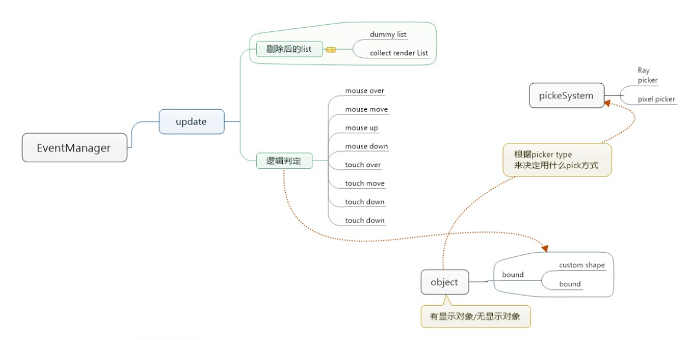

# Event入门 #
## Event基础 ##
	该篇教程将讲述cube对象的onMouseDown事件和onPickDown事件，即事件的注册，事件的响应等功能。但在这之前,我们需要简单的了解下Egret3D事件基础：    
	（1）事件的注册与管理:  
		a) Egret3D中的所有Object3D对象都继承了EventDispatcher类，EventDispatcher类是可调度事件的所有类的基类。   
		b) 通过EventDispatcher实现事件的注册，事件的保存，事件的响应，和事件的回收。  
	（2）事件的核心管理对象EventManager:  
		a) 简化流程：用户行为触发了事件，EventManager会获取到当前满足条件所有对象，根据预定义的不同事件类型，进行处理，然后判断当前对象是否被满足响应条件，
					最后分发事件。  
		b) Egret3DCanvas内会注册生成EventManager，EventManager管理者Egret3DCanvas对象所有的view3d内的事件。

**流程图：** 

## Event主要元素 ##
**EventDispatcher.listeners:**  
	事件对象字典，通过[key(event3D: Event3D)，Value(EventListener)]形式保存了所有注册的事件。

**EventDispatcher.dispatchEvent:**  
	根据Event3D事件参数，激活相应类型的注册事件进行响应。    
	Event3D 类的属性包含有关事件的基本信息，例如事件的类型。对于许多事件（如由 Event3D 类常量表示的事件，此基本信息就足够了）。

**EventDispatcher.addEventListener:**  
	使用 EventDispatcher 对象注册事件侦听器对象，以使侦听器能够接收事件通知。可以为特定类型的事件和优先级注册事件侦听器。成功注册一个事件侦听
	器后，无法通过额外调用 addEventListener() 来更改其优先级。要更改侦听器的优先级，必须首先调用 removeEventListener()。然后，可以使用新
	的优先级再次注册该侦听器。    

**EventDispatcher.removeEventListener:**  
	根据事件类型移除事件侦听器。

**EventDispatcher.removeEventListenerAt:**  
	根据事件id移除事件侦听器。

**EventDispatcher.cleanAllEventListener:**  
	移除所有事件侦听器。

**EventDispatcher.containEventListener:**  
	判断事件是否存在。

## 开启Object3D事件响应 ##
	this._cube.enablePick = true;
	
**说明：** 
	开启拣选事件响应，如果该状态为false,在获取可响应对象数组阶段被剔除。

## 注册事件 ##
	///拣选事件注册  
	this._cube.addEventListener(egret3d.PickEvent3D.PICK_DOWN, this.onPickDown, this);  
	///鼠标事件注册  
	egret3d.Input.addEventListener(egret3d.MouseEvent3D.MOUSE_DOWN, this.onMouseDown, this);
	
**说明：** 
	注册事件一般格式如上所示，所需参数（注册事件，方法名，注册对象）缺一不可，主要目的为方便事件对象的释放和内存的管理。
	拣选事件和鼠标事件由于从属关系的问题，注册时候的方式有些不同。

## 响应事件 ##
    ///拣选按下响应事件
    private onPickDown(event3D: egret3d.PickEvent3D): void {
        egret3d.Debug.instance.trace("onPickDown");
        this.EspondOnAClick();
    }
	
	///鼠标按下响应事件
	private onMouseDown(event3d: egret3d.MouseEvent3D): void {
        egret3d.Debug.instance.trace("onPickDown");
        this.EspondOnAClick();
    }

**说明：** 
	特别说明,触摸事件需要在手机环境下才能得到触发。

## 完整示例代码 ##

	/**
	* @language zh_CN
	* @classdesc
	* 创建立方体使用示例
	* @version Egret 3.0
	* @platform Web,Native
	*/
	class SampleEvent {
	    /**
	    * Canvas操作对象
	    * @version Egret 3.0
	    * @platform Web,Native
	    */
	    protected _egret3DCanvas: egret3d.Egret3DCanvas;
	    /**
	    * View3D操作对象
	    * @version Egret 3.0
	    * @platform Web,Native
	    */
	    protected _view3D: egret3d.View3D;
	    /**
	    * 立方体对象
	    * @version Egret 3.0
	    * @platform Web,Native
	    */
	    protected _cube: egret3d.Mesh;
	    /**
	    * 圆柱体对象
	    * @version Egret 3.0
	    * @platform Web,Native
	    */
	    protected _cylinder: egret3d.Mesh;
	
	    /**
	    * look at 摄像机控制器 。
	    * 指定摄像机看向的目标对象。
	    * 1.按下鼠标左键并移动鼠标可以使摄像机绕着目标进行旋转。
	    * 2.按下键盘的(w s a d) 可以摄像机(上 下 左 右)移动。
	    * 3.滑动鼠标滚轮可以控制摄像机的视距。
	    * @version Egret 3.0
	    * @platform Web,Native
	    */
	    protected cameraCtl: egret3d.LookAtController;
	
	
	    public constructor() {
	        ///创建Canvas对象。
	        this._egret3DCanvas = new egret3d.Egret3DCanvas();
	        ///Canvas的起始坐标，页面左上角为起始坐标(0,0)。
	        this._egret3DCanvas.x = 0;
	        this._egret3DCanvas.y = 0;
	        ///设置Canvas页面尺寸。
	        this._egret3DCanvas.width = window.innerWidth;
	        this._egret3DCanvas.height = window.innerHeight;
	        ///创建View3D对象,页面左上角为起始坐标(0,0),其参数依次为:
	        ///@param x: number 起始坐标x,
	        ///@param y: number 起始坐标y
	        ///@param  width: number 显示区域的宽
	        ///@param  height: number 显示区域的高
	        this._view3D = new egret3d.View3D(0, 0, window.innerWidth, window.innerHeight);
	        ///当前对象对视位置,其参数依次为:
	        ///@param pos 对象的位置
	        ///@param target 目标的位置
	        this._view3D.camera3D.lookAt(new egret3d.Vector3D(0, 0, -1000), new egret3d.Vector3D(0, 0, 0));
	        ///View3D的背景色设置
	        this._view3D.backColor = 0xff000000;
	        ///将View3D添加进Canvas中
	        this._egret3DCanvas.addView3D(this._view3D);
	        ///创建默认图片材质
	        var mat_Cube: egret3d.TextureMaterial = new egret3d.TextureMaterial();
	        ///创建立方体对象
	        var geometery_Cube: egret3d.CubeGeometry = new egret3d.CubeGeometry();
	        ///通过材质和立方体对象生成Mesh
	        this._cube = new egret3d.Mesh(geometery_Cube, mat_Cube);
	        ///开启拣选
	        this._cube.enablePick = true;
	        ///拣选事件注册
	        this._cube.addEventListener(egret3d.PickEvent3D.PICK_DOWN, this.onPickDown, this);
	        ///鼠标事件注册
	        egret3d.Input.addEventListener(egret3d.MouseEvent3D.MOUSE_DOWN, this.onMouseDown, this);
	        ///将mesh插入view3D
	        this._view3D.addChild3D(this._cube);
	      
	        this.InitCameraCtl();
	
	        ///启动Canvas。
	        this._egret3DCanvas.start();
	        this._egret3DCanvas.addEventListener(egret3d.Event3D.ENTER_FRAME, this.update, this);
	    }
	
	    /**
	    * @language zh_CN        
	    * 初始化相机控制
	    * @version Egret 3.0
	    * @platform Web,Native
	    */
	    private InitCameraCtl() {
	        ///摄像机控制类
	        this.cameraCtl = new egret3d.LookAtController(this._view3D.camera3D, new egret3d.Object3D());
	        ///设置目标和相机的距离
	        this.cameraCtl.distance = 1000;
	        ///设置相机x轴旋转
	        this.cameraCtl.rotationX = 60;
	    }
	
	    /**
	    * @language zh_CN        
	    * 拣选按下响应事件
	    * @version Egret 3.0
	    * @platform Web,Native
	    */
	    private onPickDown(event3D: egret3d.PickEvent3D): void {
	        egret3d.Debug.instance.trace("onPickDown");
	        this.EspondOnAClick();
	    }
	
	    /**
	    * @language zh_CN        
	    * 鼠标按下响应事件
	    * @version Egret 3.0
	    * @platform Web,Native
	    */
	    private onMouseDown(event3d: egret3d.MouseEvent3D): void {
	        egret3d.Debug.instance.trace("onPickDown");
	        this.EspondOnAClick();
	    }
	
	    /**
	    * @language zh_CN        
	    * 反馈
	    * @version Egret 3.0
	    * @platform Web,Native
	    */
	    private EspondOnAClick(): void {
	
	        if (this._cube.scaleX <= 2) {
	            this._cube.scaleX += 0.5;
	            this._cube.scaleY += 0.5;
	            this._cube.scaleZ += 0.5;
	        }
	        else {
	            this._cube.scaleX = 1;
	            this._cube.scaleY = 1;
	            this._cube.scaleZ = 1;
	        }
	    }
	
	    public update(e: egret3d.Event3D) {
	        this.cameraCtl.update();
	    }
	
	
	}    

  
		

			