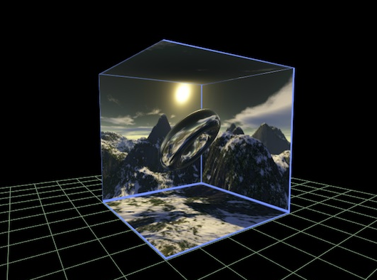
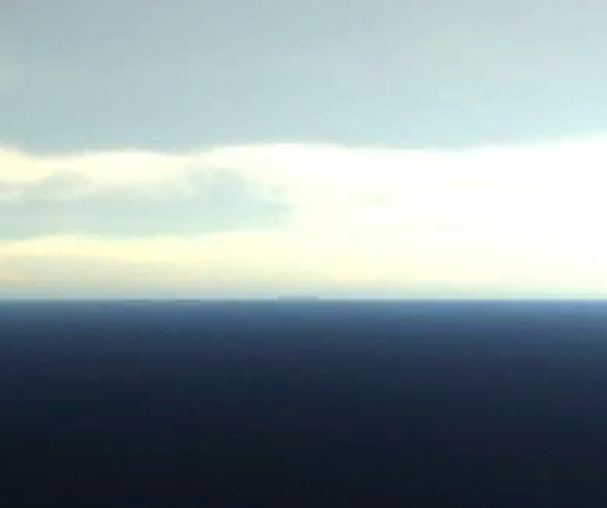

# 天空盒入门 #
## 天空盒基础 ##
	该篇教程将讲述如何创建天空盒并显示到游戏中。但在这之前,我们需要简单的了解下天空盒子的知识： 
	（1）天空常见做法：
		a)平板型天空（Sky Plane）:使用一块面片作为天空，置于游戏空间的顶部。
		b)天空穹（Sky Dome）:使用一块曲面片作为天空，置于游戏空间的顶部。
		c)天空盒（Sky Box）:这是我们当前使用的做法，构建一个包含你的场景的立方体，附上立方体贴图，构成天空，大部分情况下我们视点都包容在天空盒内部。实现方式与立方体相似，只不过顶点顺序应当是正好与普通立方体的顶点顺序相反。

**示意图:**  

## 天空盒主要元素 ##
**View3D._camera:**  
	天空盒子渲染相机。

## 创建天空盒 ##
	var cubeTexture: egret3d.CubeTexture = egret3d.CubeTexture.createCubeTexture(
            <HTMLImageElement>document.getElementById("f"),
            <HTMLImageElement>document.getElementById("b"),
            <HTMLImageElement>document.getElementById("l"),
            <HTMLImageElement>document.getElementById("r"),
            <HTMLImageElement>document.getElementById("u"),
            <HTMLImageElement>document.getElementById("d")
      );
	var sky: egret3d.Sky = new egret3d.Sky(new egret3d.CubeTextureMaterial(cubeTexture), this._view3D.camera3D);

**说明：**   
	天空贴图用于Sky类使用，其内部是将6张HTMLImageElement（网页图片元素）封装到CubeTexture对象，CubeTexture为引擎内部使用对象
	需要在html中已有img对象。

## 天空盒插入视图中 ##  
	this._view3D.addChild3D(sky);

## 完整示例代码 ##
	
	/**
	 * @language zh_CN
	 * @classdesc
	 * 天空盒使用示例
	 * @version Egret 3.0
	 * @platform Web,Native
	 */
	class SampleSky {
	    /**
	    * Canvas操作对象
	    * @version Egret 3.0
	    * @platform Web,Native
	    */
	    protected _egret3DCanvas: egret3d.Egret3DCanvas;
	    /**
	    * View3D操作对象
	    * @version Egret 3.0
	    * @platform Web,Native
	    */
	    protected _view3D: egret3d.View3D;
	    /**
	    * look at 摄像机控制器 。
	    * 指定摄像机看向的目标对象。
	    * 1.按下鼠标左键并移动鼠标可以使摄像机绕着目标进行旋转。
	    * 2.按下键盘的(w s a d) 可以摄像机(上 下 左 右)移动。
	    * 3.滑动鼠标滚轮可以控制摄像机的视距。
	    * @version Egret 3.0
	    * @platform Web,Native
	    */
	    protected cameraCtl: egret3d.LookAtController;
	
	    public constructor() {
	        ///创建Canvas对象。
	        this._egret3DCanvas = new egret3d.Egret3DCanvas();
	        ///Canvas的起始坐标，页面左上角为起始坐标(0,0)。
	        this._egret3DCanvas.x = 0;
	        this._egret3DCanvas.y = 0;
	        ///设置Canvas页面尺寸。
	        this._egret3DCanvas.width = window.innerWidth;
	        this._egret3DCanvas.height = window.innerHeight;
	        ///创建View3D对象,页面左上角为起始坐标(0,0),其参数依次为:
	        ///@param x: number 起始坐标x,
	        ///@param y: number 起始坐标y
	        ///@param  width: number 显示区域的宽
	        ///@param  height: number 显示区域的高
	        this._view3D = new egret3d.View3D(0, 0, window.innerWidth, window.innerHeight);
	        ///当前对象对视位置,其参数依次为:
	        ///@param pos 对象的位置
	        ///@param target 目标的位置
	        this._view3D.camera3D.lookAt(new egret3d.Vector3D(0, 500, -500), new egret3d.Vector3D(0, 0, 0));
	        ///View3D的背景色设置
	        this._view3D.backColor = 0xff000000;
	        ///将View3D添加进Canvas中
	        this._egret3DCanvas.addView3D(this._view3D);
	
	
	        this.InitCameraCtl();
	
	        ///天空贴图用于Sky类使用，其内部是将6张HTMLImageElement（网页图片元素）封装到CubeTexture对象，CubeTexture为引擎内部使用对象
	        //* 需要在html中已有 < /p>	        //  < pre >	        //      	        //      	        //      	        //      	        //      	        //      	        //  </pre>	        var cubeTexture: egret3d.CubeTexture = egret3d.CubeTexture.createCubeTexture(
	            <HTMLImageElement>document.getElementById("f"),
	            <HTMLImageElement>document.getElementById("b"),
	            <HTMLImageElement>document.getElementById("l"),
	            <HTMLImageElement>document.getElementById("r"),
	            <HTMLImageElement>document.getElementById("u"),
	            <HTMLImageElement>document.getElementById("d")
	        );
	        ///创建天空盒
	        var sky: egret3d.Sky = new egret3d.Sky(new egret3d.CubeTextureMaterial(cubeTexture), this._view3D.camera3D);
	        ///将天空盒子插入view3D
	        this._view3D.addChild3D(sky);
	        ///启动Canvas。
	        this._egret3DCanvas.start();
	        ///注册每帧更新，用于更新用户操作
	        this._egret3DCanvas.addEventListener(egret3d.Event3D.ENTER_FRAME, this.update, this);
	    }
	
	
	    /**
	   * @language zh_CN        
	   * 初始化相机控制
	   * @version Egret 3.0
	   * @platform Web,Native
	   */
	    private InitCameraCtl() {
	        ///摄像机控制类
	        this.cameraCtl = new egret3d.LookAtController(this._view3D.camera3D, new egret3d.Object3D());
	        ///设置目标和相机的距离
	        this.cameraCtl.distance = 1000;
	    }
	
	    public update(e: egret3d.Event3D) {
	        this.cameraCtl.update();
	    }
	
	}    

 

