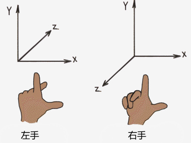
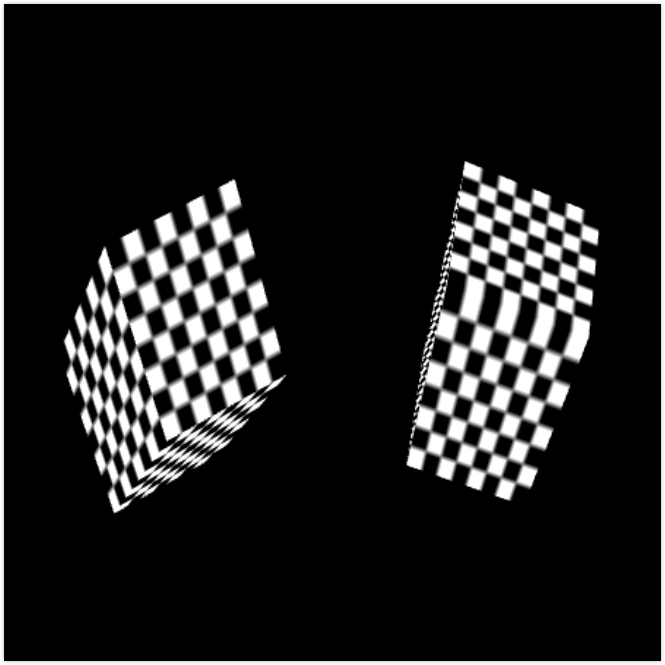

# Transform入门 #
## Transform基础 ##
	该篇教程将讲述cube对象的Transform变换，即物体的位移，旋转，缩放等功能。但在这之前,我们需要简单的了解下：  
	(1)在Egret3D中，使用了右手笛卡尔坐标系，从左到右x递增，从下到上y递增，从远到近z递增。在该坐标系的基础上，每一个场景中的各个物体基本都有:  
		position（位置坐标）, 以X、Y、Z坐标系表示变换的位置，  
		rotation（旋转角度），表示此变换以X，Y，Z轴为准的旋转程度，以角度为单位,  
		scale（缩放系数）,沿着X，Y，Z轴缩放此变换。值为"1"时表示原始尺寸（物体最初被导入时的大小）， 等Transform基本属性。当前版本的Egret3D中，变换属性都是相对其父物体进行衡量的，如果此物体没有父物体，这些属性则相对于世界坐标进行计算。
	(2)在Egret3D中，父子化是一个非常重要的概念，当一个游戏对象是另一个游戏对象的父物体时，其子游戏对象会随着它移动、旋转和缩放，就像你的胳膊属于你的身体，当你旋转身体时，你的胳膊也会跟着旋转一样。任何物体都可以有多个子物体，但只能有一个父物体。

**示意图:**  

## Transform主要元素 ##
**Object3D.parent:**  
	Object3D的父亲节点，一个Object3D有且只有一个父节点。

**Object3D.childs:**  
	Object3D的子对象节点数组，一个Object3D作为父节点，可以拥有多个子节点。

**Object3D.position:**  
	位移坐标，基于父节点的位置坐标。 

**Object3D.x:**  
	位移坐标，x轴坐标。 

**Object3D.y:**  
	位移坐标，y轴坐标。 

**Object3D.y:**  
	位移坐标，y轴坐标。 

**Object3D.rotation:**  
	旋转角度，欧拉角信息，基于父节点的旋转信息。

**Object3D.orientation:**  
	旋转角度，基于四元素旋转信息，基于父节点的旋转信息。    

**Object3D.rotationX:**  
	x轴旋转角度。    

**Object3D.rotationY:**  
	Y轴旋转角度。   

**Object3D.rotationZ:**  
	Z轴旋转角度。   

**Object3D.scale:**  
	缩放系数，基于父容器的缩放信息。 

**Object3D.scaleX:**  
	x方向缩放系数。 

**Object3D.scaleY:**  
	y方向缩放系数。 

**Object3D.scaleZ:**  
	z方向缩放系数。 

## 位移设置 ##
	///通过Vector3D设置  
	this._cube.position = new egret3d.Vector3D(100, 100, 100);  
	///直接修改坐标值  
	this._cube.x += 0.5 * this._direction;  
	this._cube.y += 0.5 * this._direction;  
	this._cube.z += 0.5 * this._direction;  

## 旋转角度设置 ##
	///通过Vector3D设置欧拉角  
	this._cube.rotation = new egret3d.Vector3D(0.5, 0.5, 0.5);  
	///直接修改欧拉角  
	this._cube.rotationY += 0.5;  
	this._cube.rotationX += 0.5;  
	this._cube.rotationZ += 0.5;  
	///欧拉角转换四维数角度  
	this._orientation.fromEulerAngles(this._rot.x, this._rot.y, this._rot.z);  
	///四维数角度转换欧拉角  
    this._angle = this._orientation.toAxisAngle(this._axis);  

## 缩放设置 ##
	///通过Vector3D设置缩放系数  
	this._cube.scale = new egret3d.Vector3D(1, 1, 1);  
	///直接修改各个轴的缩放系数  
	this._cube.scaleX += 0.2 * this._scaleRadio;  
	this._cube.scaleY += 0.01 * this._scaleRadio;  
	this._cube.scaleZ += 0.2 * this._scaleRadio;  

## 完整示例代码一 ##

	/**
	 * @language zh_CN
	 * @classdesc
	 * 立方体变换示例
	 * @version Egret 3.0
	 * @platform Web,Native
	 */
	class SampleCubeTransform {
	    /**
	    * Canvas操作对象
	    * @version Egret 3.0
	    * @platform Web,Native
	    */
	    protected _egret3DCanvas: egret3d.Egret3DCanvas;
	    /**
	    * View3D操作对象
	    * @version Egret 3.0
	    * @platform Web,Native
	    */
	    protected _view3D: egret3d.View3D;
	    /**
	    * 立方体对象
	    * @version Egret 3.0
	    * @platform Web,Native
	    */
	    protected _cube: egret3d.Mesh;
	    /**
	    * 立方体移动方向
	    * @version Egret 3.0
	    * @platform Web,Native
	    */
	    protected _direction: number = 1;
	    /**
	   * 立方体缩放系数
	   * @version Egret 3.0
	   * @platform Web,Native
	   */
	    protected _scaleRadio: number = 1;
	
	    /**
	    * look at 摄像机控制器 。
	    * 指定摄像机看向的目标对象。
	    * 1.按下鼠标左键并移动鼠标可以使摄像机绕着目标进行旋转。
	    * 2.按下键盘的(w s a d) 可以摄像机(上 下 左 右)移动。
	    * 3.滑动鼠标滚轮可以控制摄像机的视距。
	    * @version Egret 3.0
	    * @platform Web,Native
	    */
	    private cameraCtl: egret3d.LookAtController;
	
	    public constructor() {
	        ///创建Canvas对象。
	        this._egret3DCanvas = new egret3d.Egret3DCanvas();
	        ///Canvas的起始坐标，页面左上角为起始坐标(0,0)。
	        this._egret3DCanvas.x = 0;
	        this._egret3DCanvas.y = 0;
	        ///设置Canvas页面尺寸。
	        this._egret3DCanvas.width = window.innerWidth;
	        this._egret3DCanvas.height = window.innerHeight;
	        ///创建View3D对象,页面左上角为起始坐标(0,0),其参数依次为:
	        ///@param x: number 起始坐标x,
	        ///@param y: number 起始坐标y
	        ///@param  width: number 显示区域的宽
	        ///@param  height: number 显示区域的高
	        this._view3D = new egret3d.View3D(0, 0, window.innerWidth, window.innerHeight);
	        ///当前对象对视位置,其参数依次为:
	        ///@param pos 对象的位置
	        ///@param target 目标的位置
	        this._view3D.camera3D.lookAt(new egret3d.Vector3D(0, 0, -1000), new egret3d.Vector3D(0, 0, 0));
	        ///View3D的背景色设置
	        this._view3D.backColor = 0xff000000;
	        ///将View3D添加进Canvas中
	        this._egret3DCanvas.addView3D(this._view3D);
	        ///创建TextureMaterial
	        var mat: egret3d.TextureMaterial = new egret3d.TextureMaterial();
	        ///创建立方体对象
	        var geometery: egret3d.CubeGeometry = new egret3d.CubeGeometry();
	        ///通过材质和立方体对象生成Mesh
	        this._cube = new egret3d.Mesh(geometery, mat);
	        ///将mesh插入view3D
	        this._view3D.addChild3D(this._cube);
	        ///启动Canvas。
	        this._egret3DCanvas.start();
	        ///注册每帧更新，让cube进行变换
	        this._egret3DCanvas.addEventListener(egret3d.Event3D.ENTER_FRAME, this.update, this);
	
	        this.InitCameraCtl();
	    }
	    /**
	    * @language zh_CN        
	    * 初始化相机控制
	    * @version Egret 3.0
	    * @platform Web,Native
	    */
	    private InitCameraCtl() {
	        ///摄像机控制类
	        this.cameraCtl = new egret3d.LookAtController(this._view3D.camera3D, new egret3d.Object3D());
	        ///设置目标和相机的距离
	        this.cameraCtl.distance = 1000;
	        ///设置相机x轴旋转
	        this.cameraCtl.rotationX = 60;
	    }
	
	    public update(e: egret3d.Event3D) {
	        this.cameraCtl.update();
	
	        ///旋转角度设置
	        this._cube.rotationY += 0.5;
	        this._cube.rotationX += 0.5;
	        ///位移设置
	        if (this._cube.x >= 200) {
	            this._direction = -1;
	        } else if (this._cube.x <= -200) {
	            this._direction = 1;
	        }
	        this._cube.x += 0.5 * this._direction;
	        ///缩放设置
	        if (this._cube.scaleY >= 3) {
	            this._scaleRadio = - 1;
	        } else if (this._cube.scaleY <= 1) {
	            this._scaleRadio = 1;
	        }
	        this._cube.scaleY += 0.01 * this._scaleRadio;
	    }
	}     

