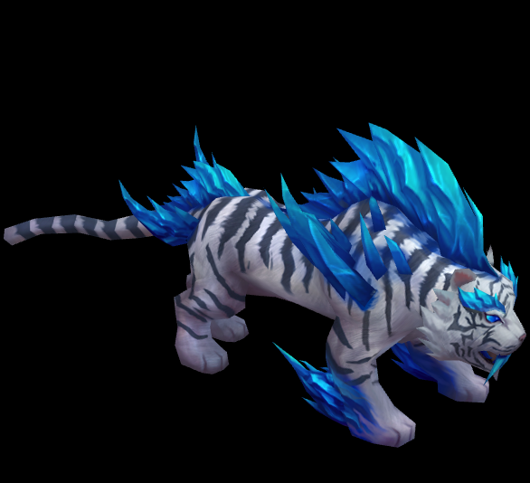

# Model入门 #
## Model基础 ##
	该篇教程将讲述如何读取模型资源显示到游戏中，即资源的异步加载，模型的加载等功能。但在这之前,我们需要简单的了解下Egret3D资源加载： 
	（1）URLLoader类，用于加载和解析各类3d资源。可以加载 DDS, TGA, jpg, png等格式的贴图文件, 也可以加载ESM, EAM, ECA等egret3d独有的模型文件,动作文件,相机动画文件。
	（2）Egret3D资源加载：  
		a) 将生成资源放入resource文件夹下，该教程使用的资源路径为resource/laohu。
		b）通过URLLoader加载到游戏引擎内。
		c) 资源拼装，进行渲染。

## Model主要元素 ##
**URLLoader.addEventListener(egret3d.LoaderEvent3D.LOADER_COMPLETE, MethodName, this):**  
	加载完成的回调函数，回调函数参数为该egret3d.LoaderEvent3D实例。

**URLLoader.url:**  
	加载文件路径，默认为相对路径。

**URLLoader.load:**   
	开始加载资源

## 创建加载类 ##
	var load: egret3d.URLLoader = new egret3d.URLLoader();

## 注册加载完成回调 ##
	load.addEventListener(egret3d.LoaderEvent3D.LOADER_COMPLETE, this.onLoad, this);

## 开始加载 ##
	load.load("resource/laohu/Mon_04.png");

**说明：**
	参数路径为相对路径。

## 生成模型mesh ##
	this.mat = new egret3d.TextureMaterial();  
	///创建模型基类 e: egret3d.LoaderEvent3D
	var ge: egret3d.Geometry = e.loader.data;
	this.model = new egret3d.Mesh(ge, this.mat);

**说明：**
	加载模型数据，生成mesh，等待加载模型纹理。

## 加载纹理 ##
	///设置材质球的漫反射贴图。
	this.mat.diffuseTexture = e.loader.data;

## 完整示例代码 ##
	
	/**
	* @language zh_CN
	* @classdesc
	* 创建模型使用示例
	* @version Egret 3.0
	* @platform Web,Native
	*/
	class SampleStaticModel {
	    /**
	    * Canvas操作对象
	    * @version Egret 3.0
	    * @platform Web,Native
	    */
	    protected _egret3DCanvas: egret3d.Egret3DCanvas;
	    /**
	    * View3D操作对象
	    * @version Egret 3.0
	    * @platform Web,Native
	    */
	    protected _view3D: egret3d.View3D;
	    /**
	    * View3D操作对象
	    * @version Egret 3.0
	    * @platform Web,Native
	    */
	    protected mat: egret3d.TextureMaterial;
	    /**
	    * look at 摄像机控制器 。
	    * 指定摄像机看向的目标对象。
	    * 1.按下鼠标左键并移动鼠标可以使摄像机绕着目标进行旋转。
	    * 2.按下键盘的(w s a d) 可以摄像机(上 下 左 右)移动。
	    * 3.滑动鼠标滚轮可以控制摄像机的视距。
	    * @version Egret 3.0
	    * @platform Web,Native
	    */
	    private cameraCtl: egret3d.LookAtController;
	    /**
	    * 模型mesh对象
	    * @version Egret 3.0
	    * @platform Web,Native
	    */
	    private model: egret3d.Mesh;
	
	    public constructor() {
	        ///创建Canvas对象。
	        this._egret3DCanvas = new egret3d.Egret3DCanvas();
	        ///Canvas的起始坐标，页面左上角为起始坐标(0,0)。
	        this._egret3DCanvas.x = 0;
	        this._egret3DCanvas.y = 0;
	        ///设置Canvas页面尺寸。
	        this._egret3DCanvas.width = window.innerWidth;
	        this._egret3DCanvas.height = window.innerHeight;
	        ///创建View3D对象,页面左上角为起始坐标(0,0),其参数依次为:
	        ///@param x: number 起始坐标x,
	        ///@param y: number 起始坐标y
	        ///@param  width: number 显示区域的宽
	        ///@param  height: number 显示区域的高
	        this._view3D = new egret3d.View3D(0, 0, window.innerWidth, window.innerHeight);
	        ///当前对象对视位置,其参数依次为:
	        ///@param pos 对象的位置
	        ///@param target 目标的位置
	        this._view3D.camera3D.lookAt(new egret3d.Vector3D(0, 0, 1000), new egret3d.Vector3D(10, 20, 30));
	        ///View3D的背景色设置
	        this._view3D.backColor = 0xff000000;
	        ///将View3D添加进Canvas中
	        this._egret3DCanvas.addView3D(this._view3D);
	        ////创建加载类
	        var load: egret3d.URLLoader = new egret3d.URLLoader();
	        ///设置加载完成回调
	        load.addEventListener(egret3d.LoaderEvent3D.LOADER_COMPLETE, this.onLoad, this);
	        ///开始加载
	        load.load("resource/laohu/Mon_04.esm");
	
	        this.InitCameraCtl();
	
	        ///启动Canvas。
	        this._egret3DCanvas.start();
	        this._egret3DCanvas.addEventListener(egret3d.Event3D.ENTER_FRAME, this.update, this);
	    }
	
	    /**
	    * @language zh_CN        
	    * 初始化相机控制
	    * @version Egret 3.0
	    * @platform Web,Native
	    */
	    private InitCameraCtl() {
	        ///摄像机控制类
	        this.cameraCtl = new egret3d.LookAtController(this._view3D.camera3D, new egret3d.Object3D());
	        ///设置目标和相机的距离
	        this.cameraCtl.distance = 1000;
	        ///设置相机x轴旋转
	        this.cameraCtl.rotationX = 60;
	    }
	
	    /**
	    * @language zh_CN        
	    * 模型加载回调
	    * @param e: egret3d.URLLoader 加载器对象
	    * @version Egret 3.0
	    * @platform Web,Native
	    */
	    protected onLoad(e: egret3d.LoaderEvent3D) {
	        ///创建纹理材质
	        this.mat = new egret3d.TextureMaterial();
	        ///创建模型基类
	        var ge: egret3d.Geometry = e.loader.data;
	        ///生成mesh
	        this.model = new egret3d.Mesh(ge, this.mat);
	
	        if (ge.vertexFormat & egret3d.VertexFormat.VF_SKIN) {
	            ///设置骨骼动画
	            this.model.animation = new egret3d.SkeletonAnimation(ge.skeleton);
	        }
	        ///插入model
	        this._view3D.addChild3D(this.model);
	
	        var loadtex: egret3d.URLLoader = new egret3d.URLLoader();
	        ///注册贴图读取完成回调
	        loadtex.addEventListener(egret3d.LoaderEvent3D.LOADER_COMPLETE, this.onLoadTexture, this);
	        ///开始读取贴图 
	        loadtex.load("resource/laohu/Mon_04.png");
	    }
	
	    /**
	    * @language zh_CN        
	    * 漫反射贴图加载回调
	    * @param e: egret3d.URLLoader 加载器对象
	    * @version Egret 3.0
	    * @platform Web,Native
	    */
	    protected onLoadTexture(e: egret3d.LoaderEvent3D) {
	        ///设置材质球的漫反射贴图。
	        this.mat.diffuseTexture = e.loader.data;
	        ///注销回调
	        e.loader.removeEventListener(egret3d.LoaderEvent3D.LOADER_COMPLETE, this.onLoadTexture, this);
	    }
	
	
	    public update(e: egret3d.Event3D) {
	        this.cameraCtl.update();
	    }
	}       

