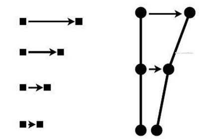
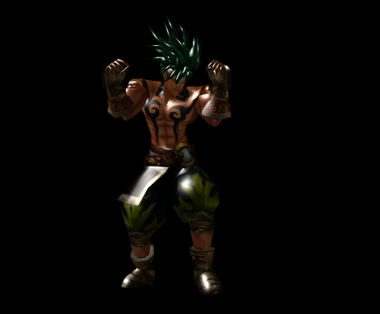
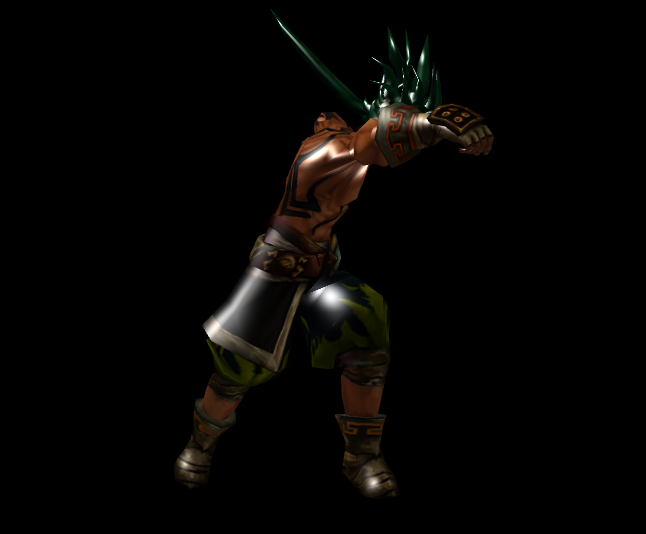

# 骨骼动画入门 #
## 骨骼动画基础 ##
	该篇教程将讲述如何在Egret3D使用模型的骨骼动画。但在这之前,我们需要简单的了解下什么是骨骼动画： 
	（1）什么是骨骼动画：
		骨骼动画，顾名思义是以骨头为基础，来实现的动画的编辑和运行，与通过编辑顶点的属性来实现动画的方式不太一样。  骨骼也是通过顶点构建的，一个顶点可以同时拥有多个骨骼，一根骨骼或者关节是定点集合的控制点。我们可以参考身体内骨骼和关节之间的关系，以及运动时候的相互作用。

	（2）骨骼动画的优势：
		a)真实性，通过骨骼的构建，可以使模型的运动更趋于运动真实性，相对于帧动画等动画的实现，骨骼动画在该方面更加实现更简单，效果更优异。
		b)资源占用量小，骨骼动画所需要存储的只是骨头的旋转和平移信息。相对于帧动画节省了巨大的空间。
		c)节省时间成本，由于骨骼动画的真实性和自由行，大大节省美术在这一块所消耗的时间。

## 骨骼动画主要元素 ##
**SkeletonAnimation.EVENT_PLAY_COMPLETE:**  
	动画播放完一个周期的事件。

**SkeletonAnimation.EVENT_FRAME_CHANGE:**  
	动画帧更改的事件。

**SkeletonAnimation.currentSkeletonMatrixData:**  
	当前播放的骨架矩阵阵列数组。

**SkeletonAnimation.jointNumber:**  
	骨骼数目。

**SkeletonAnimation.addSkeletonAnimationClip:**  
	添加SkeletonAnimationClip对象。

**SkeletonAnimation.play:**  
	播放。

**SkeletonAnimation.playOnce:**  
	播放一次

**SkeletonAnimationClip.loop:**  
	骨骼动画是否循环

**SkeletonAnimationClip.play:**  
	骨骼动画是否播放中

**SkeletonAnimationClip.timePosition:**  
	骨骼动画播放的时间位置

## 读取骨骼动画 ##
	var loadAniIdle: egret3d.URLLoader = new egret3d.URLLoader();
        
    loadAniIdle.addEventListener(egret3d.LoaderEvent3D.LOADER_COMPLETE, this.onAnimationIdle, this);
        
    loadAniIdle.load("resource/LingTong/Idle.eam");

**说明：**   
	.eam结尾的文件为动画文件

## 骨骼动画加载回调 ##
	protected onAnimationIdle(e: egret3d.LoaderEvent3D) {
	        
	        this.idle = e.loader.data;
	        
	        this.idle.animationName = "idle";
	        
	        this.model.animation.skeletonAnimationController.addSkeletonAnimationClip(this.idle);
	        
	    }

**说明：**   
	e.loader.data为读取的SkeletonAnimationClip类型动画数据，初始化动画名称后保存到模型的动画管理类型中。

## 骨骼动画加载回调 ##
	this.model.animation.skeletonAnimationController.play(clip.animationName);

**说明：**   
	根据保存的动画名称播放动画。

## 完整示例代码 ##
	/**
	 * @language zh_CN
	 * @classdesc
	 * 模型动画使用示例 
	 * @version Egret 3.0
	 * @platform Web,Native
	 */
	class SampleAnimation {
	    /**
	     * Canvas操作对象
	     * @version Egret 3.0
	     * @platform Web,Native
	     */
	    protected _egret3DCanvas: egret3d.Egret3DCanvas;
	    /**
	    * View3D操作对象
	    * @version Egret 3.0
	    * @platform Web,Native
	    */
	    protected _view3D: egret3d.View3D;
	    /**
	    * look at 摄像机控制器 。
	    * 指定摄像机看向的目标对象。
	    * 1.按下鼠标左键并移动鼠标可以使摄像机绕着目标进行旋转。
	    * 2.按下键盘的(w s a d) 可以摄像机(上 下 左 右)移动。
	    * 3.滑动鼠标滚轮可以控制摄像机的视距。
	    * @version Egret 3.0
	    * @platform Web,Native
	    */
	    private cameraCtl: egret3d.LookAtController;
	    /**
	    * 灯光组
	    * @version Egret 3.0
	    * @platform Web,Native
	    */
	    private lights: egret3d.LightGroup = new egret3d.LightGroup();
	    /**
	    * 模型对象
	    * @version Egret 3.0
	    * @platform Web,Native
	    */
	    private model: egret3d.Mesh;
	    /**
	    * 待机动画
	    * @version Egret 3.0
	    * @platform Web,Native
	    */
	    private idle: egret3d.SkeletonAnimationClip;
	    /**
	    * 跑步动画
	    * @version Egret 3.0
	    * @platform Web,Native
	    */
	    private run: egret3d.SkeletonAnimationClip;
	    /**
	    * 攻击动画
	    * @version Egret 3.0
	    * @platform Web,Native
	    */
	    private attack: egret3d.SkeletonAnimationClip;
	    /**
	     * @language zh_CN
	     * 当前动画
	     */
	    public currentAnim: string;
	
	
	
	    public constructor() {
	        ///创建Canvas对象。
	        this._egret3DCanvas = new egret3d.Egret3DCanvas();
	        ///Canvas的起始坐标，页面左上角为起始坐标(0,0)。
	        this._egret3DCanvas.x = 0;
	        this._egret3DCanvas.y = 0;
	        ///设置Canvas页面尺寸。
	        this._egret3DCanvas.width = window.innerWidth;
	        this._egret3DCanvas.height = window.innerHeight;
	        ///创建View3D对象,页面左上角为起始坐标(0,0),其参数依次为:
	        ///@param x: number 起始坐标x,
	        ///@param y: number 起始坐标y
	        ///@param  width: number 显示区域的宽
	        ///@param  height: number 显示区域的高
	        this._view3D = new egret3d.View3D(0, 0, window.innerWidth, window.innerHeight);
	        ///当前对象对视位置,其参数依次为:
	        ///@param pos 对象的位置
	        ///@param target 目标的位置
	        this._view3D.camera3D.lookAt(new egret3d.Vector3D(0, 0, 1000), new egret3d.Vector3D(10, 20, 30));
	        ///View3D的背景色设置
	        this._view3D.backColor = 0xff000000;
	        ///将View3D添加进Canvas中
	        this._egret3DCanvas.addView3D(this._view3D);
	
	        ///创建平行光
	        var dirLight: egret3d.DirectLight = new egret3d.DirectLight(new egret3d.Vector3D(-0.5, 0.6, 0.2));
	        dirLight.diffuse = 0xffffff;
	        this.lights.addLight(dirLight);
	
	
	        ////创建加载类
	        var load: egret3d.URLLoader = new egret3d.URLLoader();
	        ///设置加载完成回调
	        load.addEventListener(egret3d.LoaderEvent3D.LOADER_COMPLETE, this.onLoad, this);
	        ///开始加载
	        load.load("resource/LingTong/Bonezero.esm");
	
	        this.InitCameraCtl();
	
	        ///启动Canvas。
	        this._egret3DCanvas.start();
	        this._egret3DCanvas.addEventListener(egret3d.Event3D.ENTER_FRAME, this.update, this);
	    }
	
	    /**
	    * @language zh_CN        
	    * 初始化相机控制
	    * @version Egret 3.0
	    * @platform Web,Native
	    */
	    private InitCameraCtl() {
	        ///摄像机控制类
	        this.cameraCtl = new egret3d.LookAtController(this._view3D.camera3D, new egret3d.Object3D());
	        ///设置目标和相机的距离
	        this.cameraCtl.distance = 1000;
	        ///设置相机x轴旋转
	        this.cameraCtl.rotationX = 60;
	    }
	
	    /**
	    * @language zh_CN        
	    * 模型加载回调
	    * @param e: egret3d.URLLoader 加载器对象
	    * @version Egret 3.0
	    * @platform Web,Native
	    */
	    protected onLoad(e: egret3d.LoaderEvent3D) {
	        ///创建纹理材质
	        var mat = new egret3d.TextureMaterial();
	        ///创建模型基类
	        var ge: egret3d.Geometry = e.loader.data;
	        ///生成mesh
	        this.model = new egret3d.Mesh(ge, mat);
	
	        if (ge.vertexFormat & egret3d.VertexFormat.VF_SKIN) {
	            ///设置骨骼动画
	            this.model.animation = new egret3d.SkeletonAnimation(ge.skeleton);
	        }
	
	        this.model.material.lightGroup = this.lights;
	
	        ///插入model
	        this._view3D.addChild3D(this.model);
	
	
	        var loadtex: egret3d.URLLoader = new egret3d.URLLoader();
	        ///注册贴图读取完成回调
	        loadtex.addEventListener(egret3d.LoaderEvent3D.LOADER_COMPLETE, this.onLoadTexture, this);
	        ///开始读取贴图 
	        loadtex.load("resource/LingTong/hero_12.png");
	        loadtex["mat"] = mat;
	
	        var loadAniIdle: egret3d.URLLoader = new egret3d.URLLoader();
	        ///注册动画读取完成回调
	        loadAniIdle.addEventListener(egret3d.LoaderEvent3D.LOADER_COMPLETE, this.onAnimationIdle, this);
	        ///开始读取动画
	        loadAniIdle.load("resource/LingTong/Idle.eam");
	
	        var loadAniRun: egret3d.URLLoader = new egret3d.URLLoader();
	        ///注册动画读取完成回调
	        loadAniRun.addEventListener(egret3d.LoaderEvent3D.LOADER_COMPLETE, this.onAnimationRun, this);
	        ///开始读取动画
	        loadAniRun.load("resource/LingTong/Run.eam");
	
	        var loadAniattack: egret3d.URLLoader = new egret3d.URLLoader();
	        ///注册动画读取完成回调
	        loadAniattack.addEventListener(egret3d.LoaderEvent3D.LOADER_COMPLETE, this.onAnimationattack, this);
	        ///开始读取动画
	        loadAniattack.load("resource/LingTong/Attack1.eam");
	
	
	        ///开启拣选
	        this.model.enablePick = true;
	        ///拣选事件注册
	        this.model.addEventListener(egret3d.PickEvent3D.PICK_DOWN, this.onPickDown, this);
	    }
	
	    /**
	    * @language zh_CN        
	    * 拣选按下响应事件,负责切换动画
	    * @version Egret 3.0
	    * @platform Web,Native
	    */
	    private onPickDown(event3D: egret3d.PickEvent3D): void {
	
	        if (this.currentAnim =="idle") {
	            this.PlayAni(this.run);
	            return;
	        }
	        if (this.currentAnim == "run") {
	            this.PlayAni(this.attack);
	            return;
	        }
	        if (this.currentAnim == "attack") {
	            this.PlayAni(this.idle);
	            return;
	        }
	    }
	
	    /**
	    * @language zh_CN        
	    * 漫反射贴图加载回调
	    * @param e: egret3d.URLLoader 加载器对象
	    * @version Egret 3.0
	    * @platform Web,Native
	    */
	    protected onLoadTexture(e: egret3d.LoaderEvent3D) {
	        ///设置材质球的漫反射贴图。
	        e.loader["mat"].diffuseTexture = e.loader.data;
	        ///注销回调
	        e.loader.removeEventListener(egret3d.LoaderEvent3D.LOADER_COMPLETE, this.onLoadTexture, this);
	    }
	    /**
	    * @language zh_CN        
	    * 动画加载回调
	    * @param e: egret3d.URLLoader 加载器对象
	    * @version Egret 3.0
	    * @platform Web,Native
	    */
	    protected onAnimationIdle(e: egret3d.LoaderEvent3D) {
	        ///骨骼动画
	        this.idle = e.loader.data;
	        ///动画名称
	        this.idle.animationName = "idle";
	        ///添加clip
	        this.model.animation.skeletonAnimationController.addSkeletonAnimationClip(this.idle);
	        ///播放动画
	        this.PlayAni(this.idle);
	        ///注销回调
	        this.model.removeEventListener(egret3d.LoaderEvent3D.LOADER_COMPLETE, this.onAnimationIdle, this);
	    }
	
	    /**
	    * @language zh_CN        
	    * 动画加载回调
	    * @param e: egret3d.URLLoader 加载器对象
	    * @version Egret 3.0
	    * @platform Web,Native
	    */
	    protected onAnimationRun(e: egret3d.LoaderEvent3D) {
	        ///骨骼动画
	        this.run = e.loader.data;
	        ///动画名称
	        this.run.animationName = "run";
	        ///添加clip
	        this.model.animation.skeletonAnimationController.addSkeletonAnimationClip(this.run);
	        ///注销回调
	        this.model.removeEventListener(egret3d.LoaderEvent3D.LOADER_COMPLETE, this.onAnimationRun, this);
	    }
	
	    /**
	    * @language zh_CN        
	    * 动画加载回调
	    * @param e: egret3d.URLLoader 加载器对象
	    * @version Egret 3.0
	    * @platform Web,Native
	    */
	    protected onAnimationattack(e: egret3d.LoaderEvent3D) {
	        ///骨骼动画
	        this.attack = e.loader.data;
	        ///动画名称
	        this.attack.animationName = "attack";
	        ///添加clip
	        this.model.animation.skeletonAnimationController.addSkeletonAnimationClip(this.attack);
	        ///注销回调
	        this.model.removeEventListener(egret3d.LoaderEvent3D.LOADER_COMPLETE, this.onAnimationattack, this);
	    }
	
	
	
	
	    /**
	    * @language zh_CN        
	    * 播放骨骼动画
	    * @param clip: egret3d.SkeletonAnimationClip 骨骼动画
	    * @version Egret 3.0
	    * @platform Web,Native
	    */
	    protected PlayAni(clip: egret3d.SkeletonAnimationClip) {
	        this.currentAnim = clip.animationName;
	        ///执行动画
	        this.model.animation.skeletonAnimationController.play(clip.animationName);
	    }
	
	    public update(e: egret3d.Event3D) {
	        this.cameraCtl.update();
	    }
	} 

**说明：**     
    点击模型可以切换动画

**待机截图：**  

   

**跑步截图：**  

  

**攻击截图：**  

  