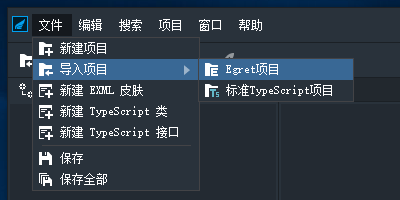
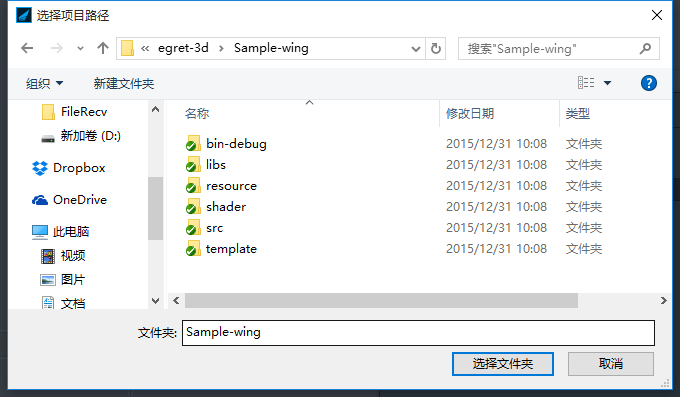
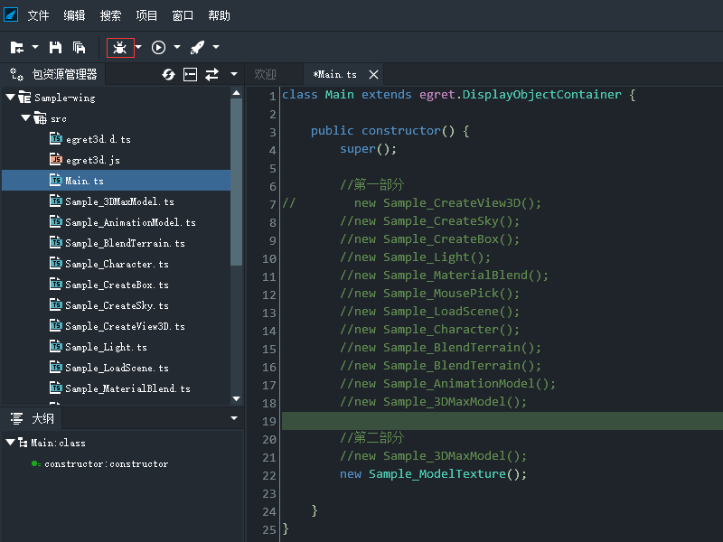

### 准备工作:

1.安装 Egret Engine, 在 http://www.egret.com/egretengine 下载最新引擎安装即可;

2.安装 Egret Wing, 通过上一步安装完整的Egret Engine 中的工具界面里安装Egret Wing

3.下载 Egret Engine 3D Sample-wing, 在 https://github.com/egret-labs/egret-3d 通过Git工具下载即可,如果未安装Git工具, 则点击网页上的Download Zip 下载压缩包, 下载完成后解压即可.

### 运行步骤:

1.运行已经安装完成的 Egret Wing 工具, 点击文件-导入项目-Egret项目: 

2.在弹出的导入Egret项目对话框中点击浏览按钮, 然后在弹出的选择项目路径对话框中选择下载完成的Sample-wing 文件夹:

3.导入成功后在Wing 界面左侧的包资源管理器面板中双击Main.ts文件, 可以看到一些示例代码, 点击下图红框中的按钮即可编译运行: 

### 常见问题解答:

1.导入选项没有Egret项目导入:

在Egret Engine 的工具选项卡界面中, 打开使用社区体验版选项.更新到最新版本的Egret Wing(至到本文发布时间(2015/12/31 时, 最新版本为2.5).

2.导入后成功后, 界面上没有运行按钮:

确保按照运行步骤1 中的通过Egret项目按钮导入.

3.编译运行报错.无法显示运行结果:

确保导入路径的正确.正确的文件夹名为Sample-wing.

4.其他问题:

请通过下方的联系方式联系我们:

egert3d 技术QQ群: 180593985
egret 开发者论坛: http://bbs.egret.com/portal.php 
