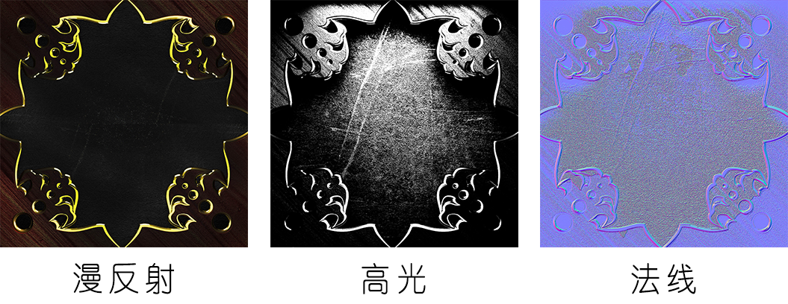
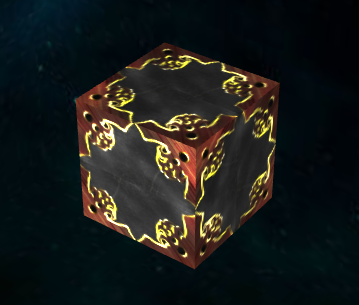
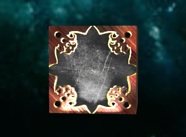
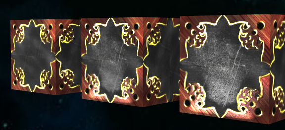

在上一节[创建天空盒子](http://edn.egret.com/cn/docs/page/832)这一节中,我们创建了一个天空包围盒并给其添加了贴图。这里简要介绍其他几种常用的贴图方式：漫反射贴图，高光贴图和法线贴图。

### 准备工作

#### 载入资源

使用贴图资源之前首先需要载入贴图，在 Egret Engine 3D 中，贴图格式支持 DDS、tga、png、jpg 和 bmp 格式的图片资源。在我们的程序主逻辑中加入贴图：

```
private loadManger:egret3d.AssetsManager;
private getTexture(){
    var loadManger:egret3d.AssetsManager = new egret3d.AssetsManager();
    loadManger.setRootURL("resource/texture/");
    loadManger.addLoadTexture("cubeTexture2048.jpg");
    loadManger.addLoadTexture("cubeTextureHL.jpg");
    loadManger.addLoadTexture("cubeTextureNormal.jpg");
    loadManger.addEventListener(egret3d.Event3D.EVENT_LOAD_COMPLETE,(e:egret3d.Event3D)=>this.textureComplete(e));
    loadManger.startLoad();

    this.loadManger = loadManger;
}
```

这里我们载入了三张贴图分别是漫反射，高光和法线贴图。下面添加回调函数，当我们加载完成之后来获取贴图资源：

```
private textureComplete(e:egret3d.Event3D) {
    var cubeTexture = this.loadManger.findTexture("cubeTexture2048.jpg");
    var cubeTextureSpecular = this.loadManger.findTexture("cubeTextureHL.jpg");
    var cubeTextureNormal = this.loadManger.findTexture("cubeTextureNormal.jpg");
}
```



需要注意的是我们使用的贴图的分辨率都是 2 的整次幂，比如 1024 * 1024 或 2048 *2048 以此类推。

#### 使用灯光

我们希望得到阴影高光等效果就要在场景中添加合适的灯光源。这里我们需要建立一个灯光组并添加一个平行光。`textureComplete`中添加：

```
var dir:egret3d.Vector3D = new egret3d.Vector3D(0,0,1);
//创建平心光
var directLight:egret3d.DirectLight = new egret3d.DirectLight(dir);

var lightGroup:egret3d.LightGroup = new egret3d.LightGroup();
//添加平行光到灯光组
lightGroup.addDirectLight(directLight);
```

在 Egret 3D 中还有点光源和聚光灯两种灯光，将在后面介绍。

### 使用贴图

在 3D 世界中，模型定义了 3D 物体的形状，可以使用图片纹理将颜色像素信息对应到模型中。图片素材也可以提供除了颜色信息之外的信息，比如使用法线贴图可以记录高度信息给 3D 引擎，在渲染时可以模拟物体表面的高度细节，尽管贴图的表面仍然是一个平面。

首先我们需要建立一个立方体几何形状:

```
var cube:egret3d.CubeGeometry = new egret3d.CubeGeometry(100,100,100);
```

#### 漫反射贴图

在 Egret 3D 中可以设置一个材质的漫反射贴图，我们使用上面的第一个素材来作为基本的满反射贴图。

```
var cube1Texture:egret3d.TextureMaterial = new egret3d.TextureMaterial();
//设置材质球的漫反射贴图
cube1Texture.diffuseTexture = cubeTexture;
//设置灯光组
cube1Texture.lightGroup = lightGroup;
var cube1Mesh = new egret3d.Mesh(cube,cube1Texture);
//添加到 3D 视口当中，这里我们使用前几节的代码，视口保存在_view3D中
this._view3D.addChild3D(cube1Mesh);
```

设置材质的`diffuseTexture`属性，即可设置材质的慢反射贴图，在上一节我们已经接触过。现在我们的立方体已经不是由黑白方块组成的表面了：



我们给这个立方体加了一个灯光组，在使用漫反射贴图时，稍微改变摄像机的镜头，可以看到在不同的角度下所展现的效果是相同的。这是因为单独使用漫反射贴图时不包含其他信息的。

#### 高光贴图

与漫反射贴图不同的是，高光贴图并不提供颜色像素信息，而是提供高光区域的反射。高光贴图需要配合漫反射贴图使用才能观察到效果。

现实生活中的物体并不是完全平均反射光线，总有些部位会看起来更加明亮。使用高光贴图可以展示物体在特定角度下的反光，可以展示更多细节，高光贴图的反射效果与光源，摄像机的角度都有关系。我们使用上面第二个的素材来演示高光贴图的效果,在原有的代码中加入设置的高光贴图:

```
//设置高光贴图
cube1Texture.specularTexture = cubeTextureSpecular;
//设置高光的强度
cube1Texture.specularPower = 10;
```

通过`specularPower`可以设置高光的强度，数值越大强度越强。需要注意的是在实际使用过程中如果强度太强容易造成过曝的效果。



这里我们可以看到在设置了高光的区域反射被加强了。当我们移动摄像机时可以看到在不同的角度下看到不同的反射效果。

#### 法线贴图

法线贴图使用 RGB 的颜色值来标记相应像素点上面的高度值，可以在 3D 引擎中可以用来渲染出更多的细节。使用法线贴图可以在不增加模型的精度的前提下展现出更多细节，在合适的场合使用可以获得更好的效果同而不消耗很多性能。

这里我们使用第三个法线贴图来展示相应效果，新建一个模型来跟原来的未使用高光贴图的模型来对比效果，代码如下：

```
//创建第二个模型
var cube2Texture:egret3d.TextureMaterial = new egret3d.TextureMaterial();
cube2Texture.diffuseTexture = cubeTexture;
cube2Texture.specularTexture = cubeTextureSpecular;
cube2Texture.lightGroup = lightGroup;
cube2Texture.specularPower = 10;
//设置法线贴图
cube2Texture.normalTexture = cubeTextureNormal;
//设置法线贴图强度
cube2Texture.normalPower = 10;
var cube2Mesh = new egret3d.Mesh(cube,cube2Texture);
cube2Mesh.x = -150;
//添加到 3D 视口当中，这里我们使用前几节的代码，视口保存在_view3D中
this._view3D.addChild3D(cube2Mesh);

//新建一个漫反射贴图模型，用来对比
var cube3Texture:egret3d.TextureMaterial = new egret3d.TextureMaterial();
cube3Texture.diffuseTexture = cubeTexture;
cube3Texture.lightGroup = lightGroup;
var cube3Mesh = new egret3d.Mesh(cube,cube3Texture);
cube3Mesh.x = 150;
//添加到 3D 视口当中，这里我们使用前几节的代码，视口保存在_view3D中
this._view3D.addChild3D(cube3Mesh);
```

编译运行可以对比三种贴图的不同效果：



最右边的立方体是使用了法线贴图的效果，中间只使用了高光贴图，最后只使用了漫反射贴图。

----

本节介绍了我们在 Egret 3D 材质中的几种贴图，漫反射贴图、高光贴图和法线贴图。

