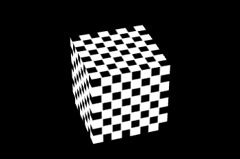

从一个简单的例子开始有助于我们学习 Egret 3D，从创建一个 Egret 3D 场景，并给它添加一个最简单的 3D 物体。

### 准备工作

在开始之前我们可以先简单了解一下需要用到的基本概念。Egret 3D 是基于 WebGL 技术的 Web 3D 引擎。也就是说我们应用 Egret 3D 所创建的项目可以运行在支持 WebGl 的浏览器中的。当我们开发和调试时，推荐使用 Chrome 浏览器来查看效果。

在 3D 的渲染引擎中很多概念和 2D 的渲染引擎不同。

**渲染基本原理**

**坐标系**

**3D对象**

### 从示例项目开始

下载和使用示例项目可以参考文档:[使用 Egret Wing 运行示例](http://edn.egret.com/cn/docs/page/830)

当然，我们现在直接创建的 Egret 项目还是传统的 Egret 2D 项目。所以最快速的开始项目的方式是直接拷贝示例项目中的代码和资源。当我们把示例项目导入到 Wing 当中之后就可以开始自己的 3D 项目了。

创建一个空的类，命名为`myCreateView3D`,我们从这个类开始创建 Egret 3D 世界。比如下面这样：

```
class myCreateView3D {

    public constructor() {
        
    }
}
```

当然在入口类`Main`里面我们仍然需要实例化该类：

```
class Main extends egret.DisplayObjectContainer {

    public constructor() {
        super();
        new myCreateView3D();
    }
}
```

#### 创建 3D 视口

我们的 3D 程序运行在支持 WebGL 的浏览器中，在创建 3D 世界之前需要我们规定在浏览中的渲染区域。我们之后的 3D 对象都需要添加到这个 3D 视口当中才能被显示出来。

这里我们需要一个`egret3d.Rectangle`矩形对象来表示我们的窗口有多大。先将这个对象保存到成员变量当中，因为下面还会用到。

```
private _viewPort:egret3d.Rectangle;
```

在构造函数中我们来初始化这个视口,`Rectangle`的构造函数可以传入四个参数，来快速创建这个矩形对象，分别是开始的位置`x`,`y`和矩形的大小`w`,`h`：

```
this._viewPort = new egret3d.Rectangle(0,0,600,800);
```

在 Egret 3D 中我们是需要 GPU 来参与渲染的。在初始化 3D 场景之前我们需要来确定渲染的方式，通过`Egret3DDrive`的`requstContext3D`来设置渲染方式和视口。在我们使用 Egret 3D 的过程中，这一设置也可以当做套路来进行。这样我们的程序就变成下面这样:

```
class myCreateView3D {

    private _viewPort:egret3d.Rectangle;

    public constructor() {
        this._viewPort = new egret3d.Rectangle(0,0,600,800);

        egret3d.Egret3DDrive.requstContext3D(DeviceUtil.getGPUMode,this._viewPort,()=>this.init3D());
    }
    private init3D() {

    }
}
```

我们通过`requstContext3D`来获取GPU交换链表程序，其中`requstContext3D`需要三个参数，第一个参数是 GPU 的类型，一般我们通过`DeviceUtil.getGPUMode` 来获取。第二个参数就是我们上面定义好的视口大小,最后我们传入回调函数，当`Egret3DDrive`初始化之后将回调`init3D`.

这里有一个较新的语法特性，使用箭头函数来指定回调函数，这种方式可以避免回调的 this 绑定带来的问题和困扰。在 TypeScript 中使用这样的方式会编译成浏览器支持的兼容代码，大家并不需要担心浏览器的支持问题同时使用新的语法特性。

最后我们来创建一个`egret3d.View3D`对象，修改 init3D 部分代码如下：

```
private _view3D:egret3d.View3D;
private init3D() {
    //创建View3D对象;    
    this._view3D = new egret3d.View3D(this._viewPort);
}
```

这里我们创建了一个 View3D 对象，保存在成员变量`_view3D`中。这就是我们要在浏览器中渲染的视口了。在 Egret 3D 中 View3D 对象有些类似于舞台的概念，所有的显示对象都要添加到这个舞台上才能被渲染出来。这里我们创建的 View3D 对象只使用了一个参数，就是确定下来的视口，还有另一个可选参数是可选的 3D 摄像机。以后会用到不同的 3D 摄像机就是在这里设置的。

#### 更新画面显示

当我们创建好 3D 视口之后还需要渲染更新。一般情况下我们可以使用`requestAnimationFrame`来更新渲染，当然也可以使用其他方法来提供更新函数。`requestAnimationFrame`是 HTML 5 中新提供的动画帧事件函数。当支持的浏览器准备好这次渲染之后进行回调。一般情况下浏览器将使用每秒 60 帧的方式进行回调。浏览器进行渲染和回调的时候会根据实际情况调整每帧的间隔，所以在这种情况下我们需要记录下每帧的时间间隔来进行渲染。修改我们的代码如下：

```
private init3D() {

    this._view3D = new egret3d.View3D(this._viewPort);
    //记录起始时间    
    this._time = new Date().getTime();
    //开始循环
    requestAnimationFrame(() => this.onUpdate());
}


protected _time: number = 0;
protected _delay: number = 0;
protected _timeDate: Date = null;

protected onUpdate(): void {
    //获取当前时间
    this._timeDate = new Date();
    //获取上一帧的时间间隔
    this._delay = this._timeDate.getTime() - this._time;
    //更新时间
    this._time = this._timeDate.getTime();
    //渲染主循环
    this._view3D.update(this._time, this._delay);
    //循环调用
    requestAnimationFrame(() => this.onUpdate());
}
```

需要注意的是我们使用`this._view3D.renden`方法来更新渲染。`renden`方法是渲染的主循环，这里需要传入当前的时间和上一帧的时间间隔。


#### 控制摄像机

由 2D 引擎所创建的项目本是直接渲染在屏幕视口这一平面上的。而当我们使用 3D 引擎的时候我们就需要一个“观察者”来将确定需要渲染的视角屏幕上来渲染到屏幕。通常我们需要一台虚拟的摄像机来充当“观察者”。

在 Egret 3D 中提供了多种控制器，可以使用控制器来方便的控制摄像机运动。这里我们先使用其中的一种，`HoverController`悬浮控制器。修改程序添加`HoverController`：

```
private _cameraCtl:egret3d.HoverController;

private init3D() {

    this._view3D = new egret3d.View3D(this._viewPort);

    this._time = new Date().getTime();

    this._cameraCtl = new egret3d.HoverController(this._view3D.camera3D,null,0,30);

    requestAnimationFrame(() => this.onUpdate());
}
```

`HoverController` 控制器的构造函数有很多可选参数，这里我们首先传入的是 View3D 对象的 3D 摄像机属性，这样就可以控制舞台内的摄像机了。第二个参数是所要对着的 3D 物体，这里还没有任何物体可以先设置为 `null` ,最后两个参数是开始的 y 轴旋转角度和 x 轴旋转角度。一般情况下我们可能调整摄像机的很多数值，比如下面这样,设置模板和摄像机之间的距离：

```
//设置目标和相机之间的距离
this._cameraCtl.distance = 1500;
```

最后还要在帧循环中更新摄像机数据,在`onUpdate`函数中加入

```
//更新摄像机数据
this._cameraCtl.update();
```

#### 创建 3D 对象

虽然我们天剑了摄像机，但是到目前为止我们编译运行程序还是只能活得一个黑色的视口，因为我们的 3D 舞台上还没有任何显示对象。跟 Egret 2D 的显示列表理论类似，我们需要的是将 3D 显示对象添加到舞台。下面我们创建一个最简单的 3D 对象一个空的 3D 盒子。

```
//创建一个立方体
var cube:egret3d.CubeGeometry = new egret3d.CubeGeometry(100,100,100);
//创建一个空的材质
var texture:egret3d.TextureMaterial = new egret3d.TextureMaterial();
//创建网格 3D 对象 
var mesh:egret3d.Mesh = new egret3d.Mesh(cube,texture);
//将创建的 3D 对象添加到舞台
this._view3D.addChild3D(mesh);
```

Mesh 是 Egret 3D 中最基本也是使用最多的 3D 对象。它表示一个 3D 模型数据和贴图的网络集合。这里我们创建一个立方体，和一个空的材质用来创建这个 Mest 对象。跟 Egret 2D
的场景树的概念类似，使用`this._view3D.addChild3D(mesh);`将创建好的 3D 对象来添加到舞台。同时我们创建的 Mesh 对象也是一个显示容器，之后的对象和模型也可以通过它的`addChild`方法来添加子对象。

到目前为止我们创建了一个最简单的 3D 场景，编译运行后可以看到效果是下面这个样子的:




