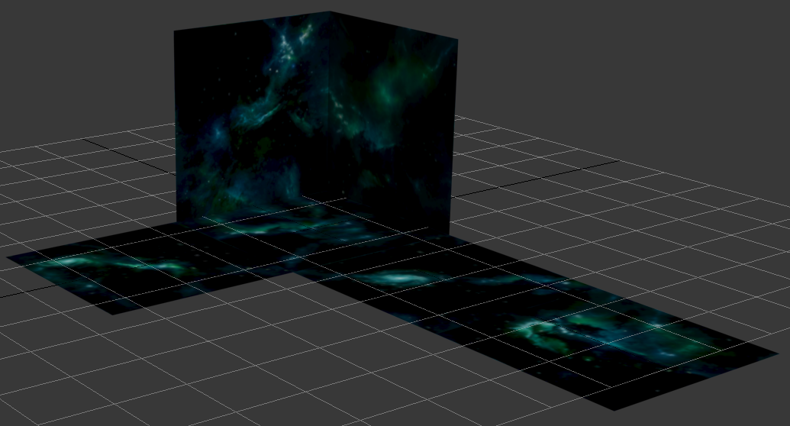
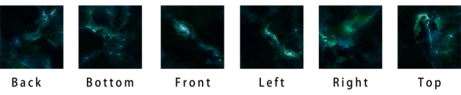
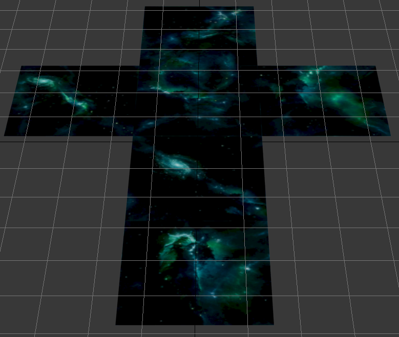
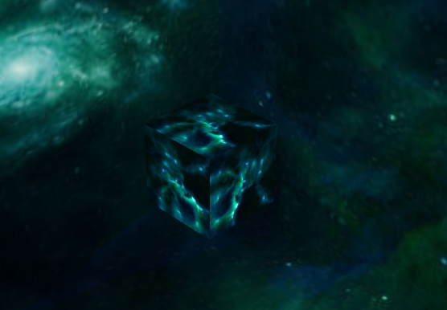

上一节我们创建了最简单的一个 3D 场景。如何让空旷的场景变的丰富起来呢，这节丰富我们的场景，添加最外层的天空包围盒。3D 场景中是一个立体的控件，最外层是用天空盒子包围起来的。
Egret 3D 中使用 `Sky` 来创建天空包围盒，下面介绍 Egret 3D 中的空间概念和如何给盒子添加无缝的贴图。

## Egret 3D 的空间

### 坐标系统

在创建更复杂的应用场景之前，先来了解一下 Egret 3D 的空间体系。与 2D 的平面空间不同，3D 坐标系之间不一定是等价的。实际上，存在两种完全不同的 3D 坐标系：左手坐标系和右手坐标系。如果同属左后坐标系或右手坐标系，则可通过旋转来融合，否则不可以。“左手”和“右手”又有什么不同呢？伸出左手，让拇指和食指成“L”型，大拇指向右，食指向上，其余手指指向前方。现在我们建立了一个左手坐标系。其三个手指指向的方向就是 x、y、z 轴的正方向。右手坐标系同理。

同属左手坐标系都是可以通过旋转来得到的。在 Egret 3D 中，世界坐标系是一个左手坐标系。

### 天空盒子

在 Egret 3D 所创建的空间中最外层是由天空盒子来包裹起来的。我们通常使用天空盒子来展现风景，地平线，天空，星空等等空间的“大背景”。天空盒子由一组无缝的贴图包裹起来的盒状空间。当我们的 3D 场景中包含有物体时，天空盒子总是充当其背景。如果我们把盒子展开的话就是下面这个样子：



## 使用 Egret 3D 天空盒子

### 创建 3D View

在上一节里面体用了创建 3D View 的方法。这里我们可以直接修改上一节的代码：

```
class myCreateView3D {

    private _viewPort:egret3d.Rectangle;

    public constructor() {        
        this._viewPort = new egret3d.Rectangle(0,0,600,800);
        egret3d.Egret3DDrive.requstContext3D(DeviceUtil.getGPUMode,this._viewPort,()=>this.init3D());
    }

    private _view3D:egret3d.View3D;
    private _cameraCtl:egret3d.HoverController;
    private _mesh:egret3d.Mesh;
    
    private init3D() {

        this._view3D = new egret3d.View3D(this._viewPort);
        this._time = new Date().getTime();
        this._cameraCtl = new egret3d.HoverController(this._view3D.camera3D,null,0,30);
        this._cameraCtl.distance = 1500;

        var cube:egret3d.CubeGeometry = new egret3d.CubeGeometry(100,100,100);
        var texture:egret3d.TextureMaterial = new egret3d.TextureMaterial();
        var mesh:egret3d.Mesh = new egret3d.Mesh(cube,texture);
        this._mesh = mesh;
        
        this._view3D.addChild3D(mesh);
        requestAnimationFrame(() => this.onUpdate());
    }
    
    protected _time: number = 0;
    protected _delay: number = 0;
    protected _timeDate: Date = null;

    protected onUpdate(): void {

        this._timeDate = new Date();
        this._delay = this._timeDate.getTime() - this._time;
        this._time = this._timeDate.getTime();
        this._view3D.update(this._time, this._delay);
        requestAnimationFrame(() => this.onUpdate());
        this._cameraCtl.update();
    }
}
```

### 加载资源

在使用贴图之前我们需要加载所使用的贴图资源，在 Egret 3D 中使用 `AssetsManager` 来加载资源。加载资源通常需要经过一下步骤：

**设置加载资源的根目录**

通过Egret 3D 的 AssetsManager 类的 `setRootURL()`来设置加载文件的根目录。


**加载资源**

AssetsManager 可以加载不同种类的资源，比如动画模型，静态模型，地形等。不同的资源将解析成不同的数据格式以供不同的类使用。这里我们加载贴图数据使用`addLoadTexture`方法。

**监听资源加载完成**

我们需要监听资源加载完成 EVENT_LOAD_COMPLETE 事件，当资源加载完成时将调用回调。

**开始加载**

最后需要注意的是要调用 AssetsManager 的 `startLoad` 方法来开始加载。

**获得加载的资源**

不同的资源有不同的解析格式，这里我们加载的贴图资源使用`findTexture`来获取到加载的资源

下面我们使用准备好的天空盒子的六个面的资源，修改`init3D`,添加下列加载天空盒子资源代码：





```   
egret3d.AssetsManager.getInstance().setRootURL("resource/");
egret3d.AssetsManager.getInstance().addLoadTexture("SkyBox/skybox_clear_f.jpg");
egret3d.AssetsManager.getInstance().addLoadTexture("SkyBox/skybox_clear_b.jpg");
egret3d.AssetsManager.getInstance().addLoadTexture("SkyBox/skybox_clear_l.jpg");
egret3d.AssetsManager.getInstance().addLoadTexture("SkyBox/skybox_clear_r.jpg");
egret3d.AssetsManager.getInstance().addLoadTexture("SkyBox/skybox_clear_u.jpg");
egret3d.AssetsManager.getInstance().addLoadTexture("SkyBox/skybox_clear_d.jpg");
egret3d.AssetsManager.getInstance().addEventListener(egret3d.Event3D.EVENT_LOAD_COMPLETE,(e: egret3d.Event3D) => this.initScene(e));
egret3d.AssetsManager.getInstance().startLoad();
```

添加回调函数：

```
//回调函数
private initScene(e:egret3d.Event3D) {
    var sky_f: egret3d.TextureBase = egret3d.AssetsManager.getInstance().findTexture("SkyBox/skybox_clear_f.jpg");
    var sky_b: egret3d.TextureBase = egret3d.AssetsManager.getInstance().findTexture("SkyBox/skybox_clear_b.jpg");
    var sky_l: egret3d.TextureBase = egret3d.AssetsManager.getInstance().findTexture("SkyBox/skybox_clear_l.jpg");
    var sky_r: egret3d.TextureBase = egret3d.AssetsManager.getInstance().findTexture("SkyBox/skybox_clear_r.jpg");
    var sky_u: egret3d.TextureBase = egret3d.AssetsManager.getInstance().findTexture("SkyBox/skybox_clear_u.jpg");
    var sky_d: egret3d.TextureBase = egret3d.AssetsManager.getInstance().findTexture("SkyBox/skybox_clear_d.jpg");     
}
```

### 创建天空盒子

上面我们创建了天空盒子的相关资源，使用这些资源就可以拼接处天空盒子了。在 `initScene` 中加入如下代码就可以设置这个 3D 场景的天空盒子了：

```
//设置贴图素材
var skyTexture: egret3d.SkyTexture = new egret3d.SkyTexture(sky_f,sky_b,sky_l,sky_r,sky_u,sky_d);
var sky: egret3d.Sky = new egret3d.Sky(skyTexture);

this._view3D.sky = sky;
```

需要注意的是我们使用天空盒子资源的顺序：前、后、左、右、上、下。

然后像下面这样给已经建好的`mesh`添加贴图，在`initScene`继续加入下面代码:

```
var textureMaterial = new egret3d.TextureMaterial(sky_d);
this._mesh.material = textureMaterial;
```

编译运行之后可以看到最终的效果是下面这样的，：



----

本节创建了 Egret 3D 最外层的包围盒，并给它添加合适的贴图。在场景中之后一个简单的正方体，并给他一个简单的贴图材质。关于模型和贴图将在后面的具体用法将在后面的章节讲到。


